# Virtualization

Virtualization can help deal with the problem of having to use multiple operating systems although it requires some level of operating system administration knowledge to fully exploit. At the most basic level a person can install a Virtualization package onto a desktop or laptop and then host one or more "guest" operating systems on top of that which will appear to be running "natively" on your hardware. 

The "guest" opersting system will use the hard drive, memory, keyboard, mouse, touch pad just as it was running on its own. OF coruse a limistation of this approach is that the guest operating system will be competing with your host operasting system for resources so you will need to appropriately allocate resources to the guest OS when you set it up to ensure decent performance. 

The most common virtualization setup I see are people with Apple laptops wanting to run MS Windows on their Apple. Apple even has a product for this called [Parallels](https://www.parallels.com/products/desktop/) which cost around $80 though open soruce tools like Virtualobox can also provide accress  There is a also a product called VMWare which can do this so there are some options. Of course there are Windows users who want to run Linux on top of their Windows OS. You could also be a Windows user who wants to run a protected copy of Windows on top of your "host" Windows to do some experiments without impacting your natively installed copy. 


<center>
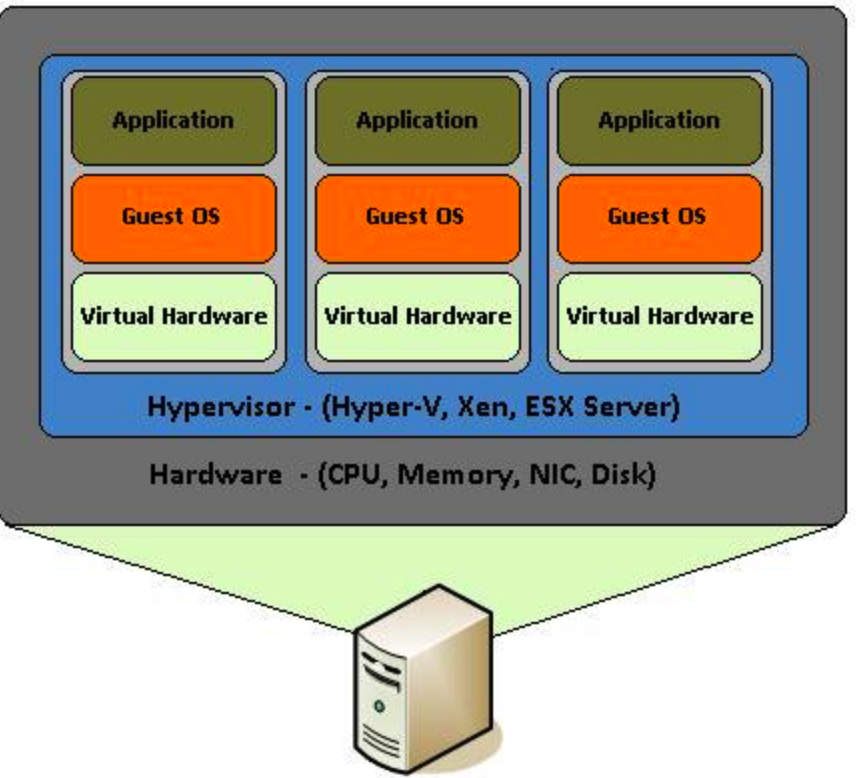{width=450}
</center>

## Virtual Box

There is a free virtualization tool called VirtualBox that can be downloaded for free for use on Windows, Apple, or Linux hardware. It works pretty well and the price is right. Keep in mind that any operating systems you install within Virtual Box will share the hard drive and memory of you desktop or laptop. Also consider that if you wanted to run MS Windows as a guest operating system that you would need to get a license for it. That is, just because you have the ability to run Windows as a guest OS does not mean that it would be free. You are still bound by the license terms that apply to any version of Windows. With Linux of course it's free. 


\
Here is a screenshot of my Apple laptop where I used a copy of Virtualbox to host an installation of Mint Linux which is a small version of Linux.

\

<center>
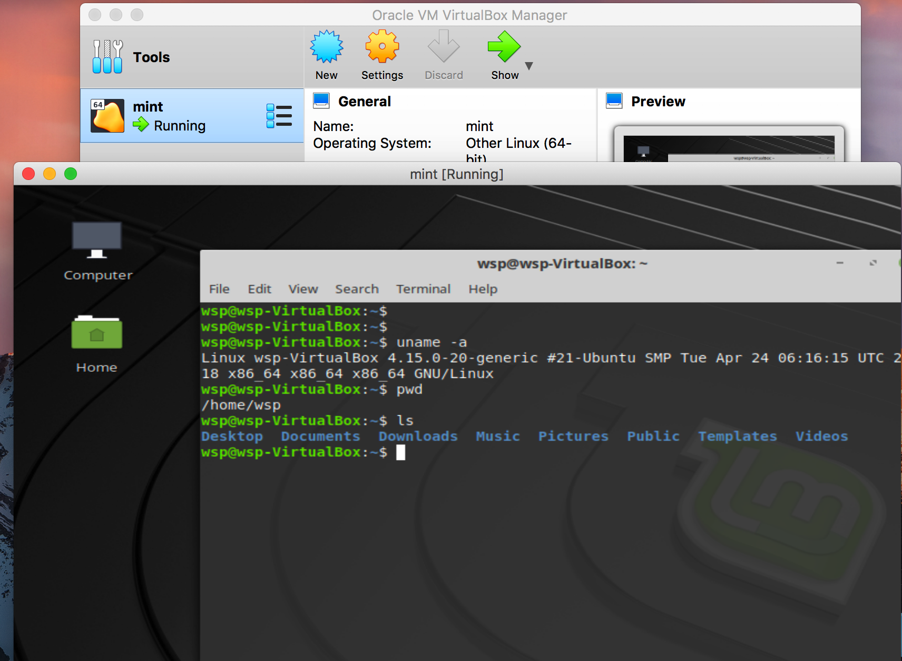
</center>

## Using Virtualization Farms

You have probably heard of Amazon. It provides virtualization capabilities at a very large scale as well as many other services that exploit this ability. Both Google and Microsoft also have this capability but Amazon has a head start. 

## Running RStudio on Amazon

I'll assume that you know something about getting into Amazon so I'll jump right in. For this example I will use the Ubuntu 18 which is the newest although typically one would use a version that has been around for a few years. For Ubuntu that would be version 16 or even 14. The advantage of using something older is that there is more Google information on various problems that might emerge. I'm picking Ubuntu 18 because I wanted to see how it differed, if at all, from the previous versions. There are some oddities but nothing major.


### Why Ubuntu ? 

I'm using Ubuntu because it is the most friendly Linux OS for bioinformatics tools although almost any known version of Linux could be used - it's just that you might have to use different package managers. CentOS is a popular alternative and there are a number of other "distros".

<center>
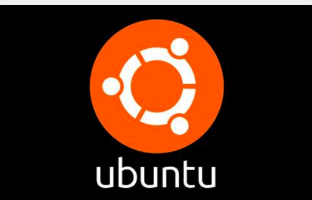{width=500}

</center>

### Start An Instance

Login to your Amazon AWS account and select something like a t2.medium instance with around 50-100GB of space. This will vary with your project needs but this is just an example. 

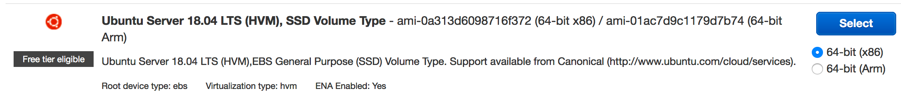
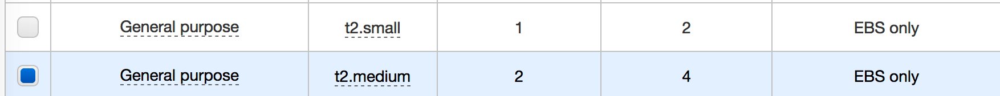

### Add Some Storage

Add some storage to the instance. If you find yourself wanting to add a lot of storage here then you should consider adding a separate volume. That way when we later create an AMI (Amazon Machine Image) you don't make an image out of a very large volume which will in turn cost more money. 

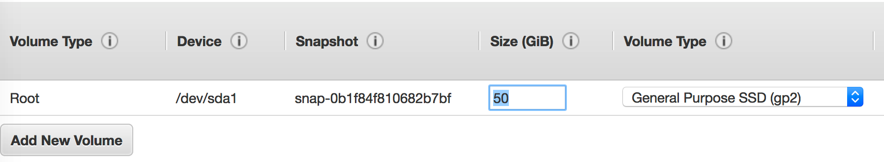

### Get A Key

As always you will need a key to get into your instance. Either select an existing key or create a new one.

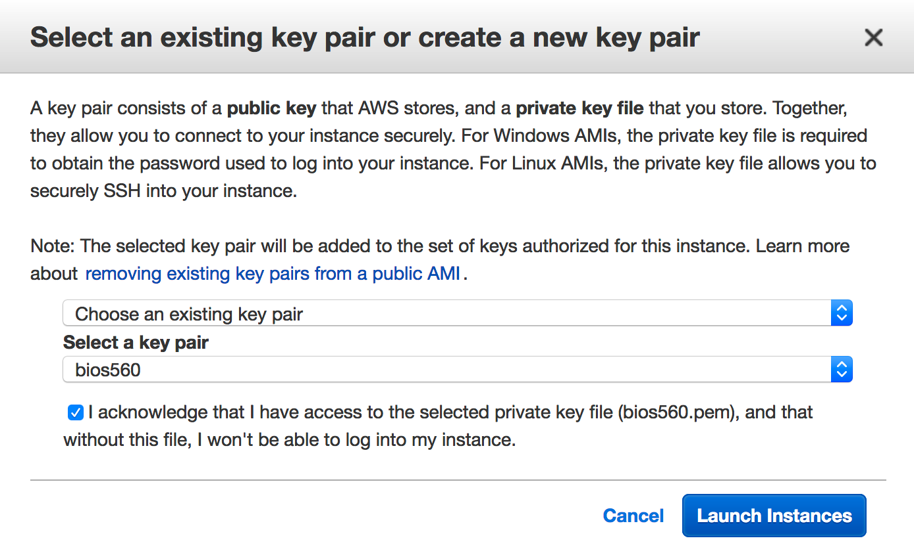

### Installing R

Once you have your instance up and running let's install the latest version of R. Strictly speaking we don't have to install the absolute latest version. If we make no effort to get the latest version then we will get whatever version of R was current at the time the release was built. You can refer to [this page](https://linuxize.com/post/how-to-install-r-on-ubuntu-18-04/) for specific information on how to get the latest R release. With Linux there are a number of supporting packages that you will need to get to install packages like tidyverse. The same is true with the RStudio Server software. 


```{r eval=FALSE}
$ sudo apt install apt-transport-https software-properties-common

$ sudo apt install build-essential

$ sudo apt-key adv --keyserver keyserver.ubuntu.com --recv-keys E298A3A825C0D65DFD57CBB651716619E084DAB9

$ sudo add-apt-repository 'deb https://cloud.r-project.org/bin/linux/ubuntu bionic-cran35/'

$ sudo apt install libcurl4-openssl-dev libssl-dev libxml2-dev

$ sudo apt update

$ sudo apt install r-base
```

So for now just accept that you will have to install some packages in support of getting the latest version of R. Knowing something about system administration is a good thing particularly as it relates to the package manager "apt-get". You don't have to be an expert but it's important to know how to add, remove, and update packages. 


```{r eval=FALSE}

$ R --version
R version 3.5.3 (2019-03-11) -- "Great Truth"
Copyright (C) 2019 The R Foundation for Statistical Computing
Platform: x86_64-pc-linux-gnu (64-bit)

R is free software and comes with ABSOLUTELY NO WARRANTY.
You are welcome to redistribute it under the terms of the
GNU General Public License versions 2 or 3.
For more information about these matters see
http://www.gnu.org/licenses/.

# Here you can install tidyverse. This will compile the code for tidyverse

$ R

> install.packages("tidyverse")

```


### Installing RStudio Server

The next step involves installing the RStudio server software which requires some supporting files:


```{r eval=FALSE}
$ sudo apt-get -y install gdebi-core
```

Next we want to go to the [Downloads page](https://www.rstudio.com/products/rstudio/download-server/) for RStudio to get a version of RStudio server that is approved for use with Ubuntu 18. 

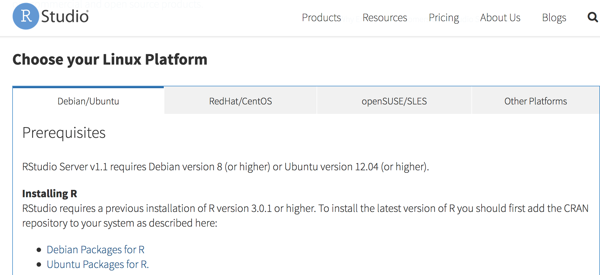


```{r eval=FALSE}
$ wget https://download2.rstudio.org/rstudio-server-1.1.463-amd64.deb

$ sudo gdebi rstudio-server-1.1.463-amd64.deb

Created symlink /etc/systemd/system/multi-user.target.wants/rstudio-server.service → /etc/systemd/system/rstudio-server.service.
● rstudio-server.service - RStudio Server
   Loaded: loaded (/etc/systemd/system/rstudio-server.service; enabled; vendor preset: enabled)
   Active: active (running) since Tue 2019-04-02 02:33:57 UTC; 1s ago
  Process: 32618 ExecStart=/usr/lib/rstudio-server/bin/rserver (code=exited, status=0/SUCCESS)
 Main PID: 32628 (rserver)
    Tasks: 3 (limit: 4704)
   CGroup: /system.slice/rstudio-server.service
           └─32628 /usr/lib/rstudio-server/bin/rserver

Apr 02 02:33:57 ip-172-30-1-144 systemd[1]: Starting RStudio Server...
Apr 02 02:33:57 ip-172-30-1-144 systemd[1]: Started RStudio Server.

$ sudo rstudio-server verify-installation
```

## Accessing Your Instance

If the installation went as expected then fire up your favorite web browser and
point it at the public IP number associated with your instance:

<center>
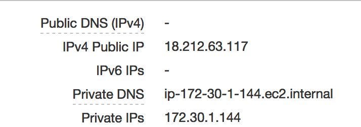{width=450}
</center>

```{r eval=FALSE}
http://18.212.63.117:8787
```


This probably won't work unless as part of the instance setup you thought to allow inbound connections on port 8787. Most people forget but that's okay. You can go back and fix this by looking at your instance details and identifying your security group. After that you can change the inbound rules.

<center>
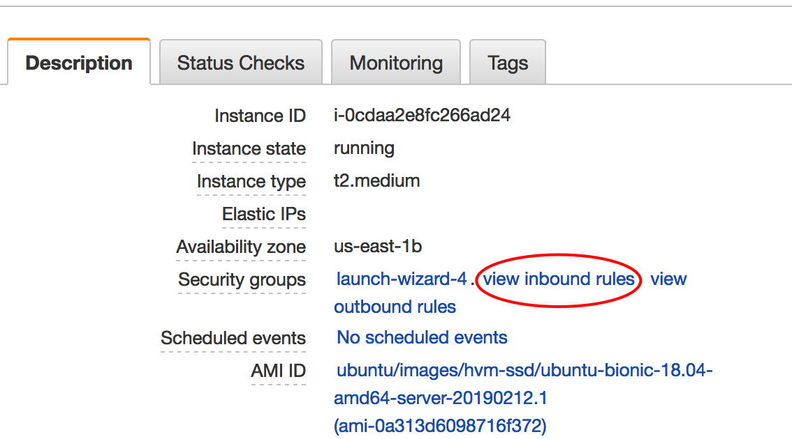{width=500}
</center>

<center>
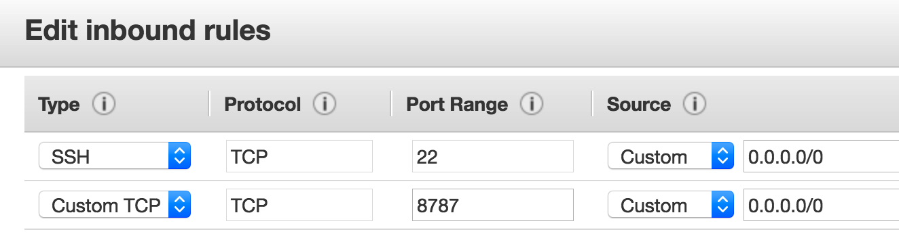{width=500}
</center>

Now you should be able to access the web interface for RStudio with your browser. The question then becomes what userid should you use ? Well you could add one or more userids and create passwords. The installation of RStudio is able to accept userid and password information for users on your system. Let's change the password on the default **ubuntu** password so we can get in. To do this go back to your terminal where you logged into your instance. Use the **passwd** command to change the password. Afer you do this then you can log into your RStudio instance


```{r eval=FALSE}
$ sudo passwd ubuntu
Enter new UNIX password: 
Retype new UNIX password: 
passwd: password updated successfully
```

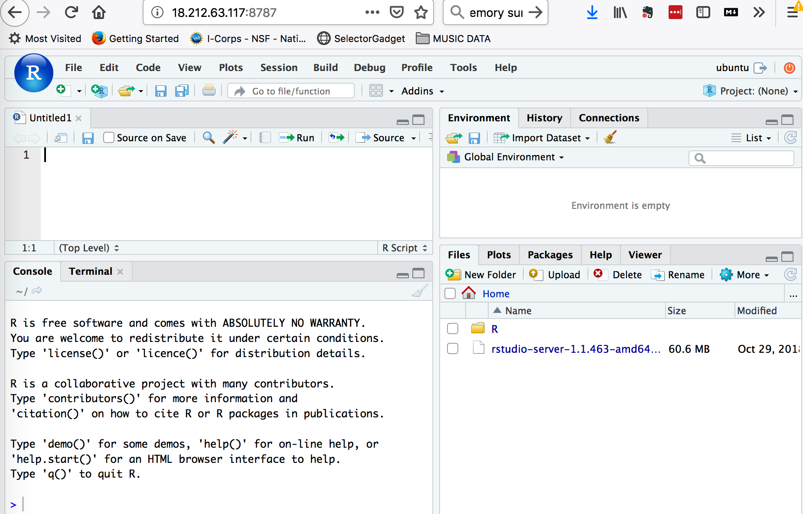


## Getting Data Into Your Instance

You now have access to a remote instance of RStudio but you need to figure out how to get data into it. You could use something like the **scp** or **sftp** command to upload data from your laptop into your instance. That's one way to do this. Let's say we have a local folder named **test_data** that we want to copy up to our instance. 

```{r eval=FALSE}
$ scp -i ~/.ssh/bios560.pem -r test_data ubuntu@18.212.63.117:/home/ubuntu
bird                                    100%   13     0.5KB/s   00:00    
cat                                     100%    0     0.0KB/s   00:00    
dog                                     100%   15     0.6KB/s   00:00    

```

<center>
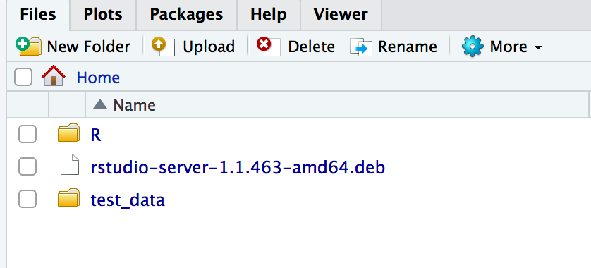{width=550}
</center>

## Accessing S3 from EC2 Instances

Another way to get data into your instance is by copying it over from your S3 buckets. S3 is object based storage that is very cheap and you can stock pile data over there until you are ready to analyze it. But you need to know how to copy it over. There are a couple of ways to do this. The first is that you could assign a role that would allow your instance to access S3 as you create the instance. Or you could make a change once it is up and running as follows:

<center>
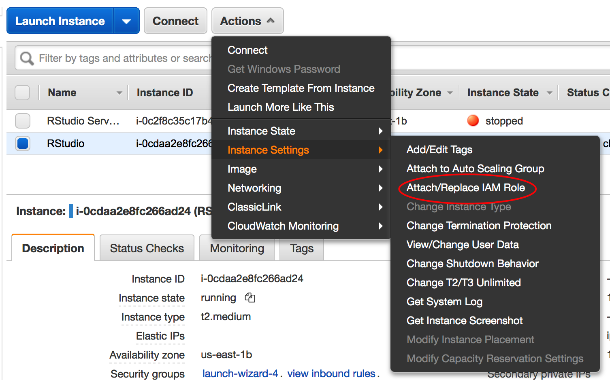{width=550}
</center>

\

The idea is to assign a role that will allow your EC2 instance to "read" your S3 buckets.

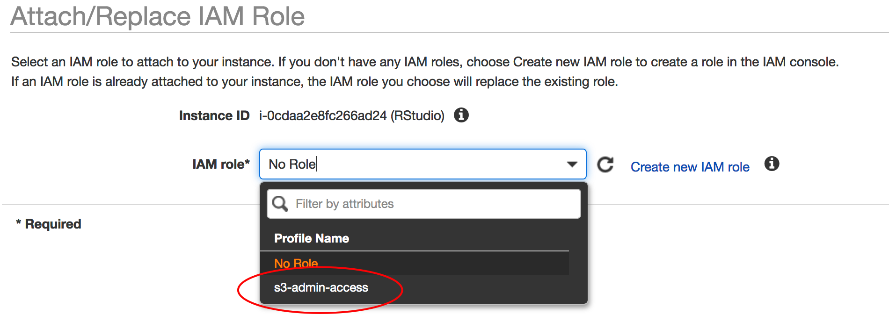

So you can now access your S3 resources using the AWS CLI (Command Line Interface). You can do this from your Terminal window. For the S3 CLI documentation go [here](https://docs.aws.amazon.com/cli/latest/userguide/cli-services-s3-commands.html)

```{r eval=FALSE}

$ sudo apt-get install awscli

$ aws s3 ls
2012-11-04 02:23:18 R_Stuff
2014-04-24 18:53:17 bimcore_final_figures
2015-04-08 18:29:09 cm-89cc48c8931698be927013c2775cf11e
2018-11-30 03:31:29 juniferous
2014-11-03 21:44:19 pittaraujo13
2014-04-24 18:39:45 steviep42bitbucket

$ aws s3 ls s3://juniferous
                           PRE AWSLogs/
2018-12-05 20:19:04         97 error.html
2018-12-04 21:57:39         13 healthcheck.html
2018-12-05 20:19:03        732 index.html
2019-04-01 21:37:18   63566904 rstudio-server-1.1.463-amd64.deb

```

