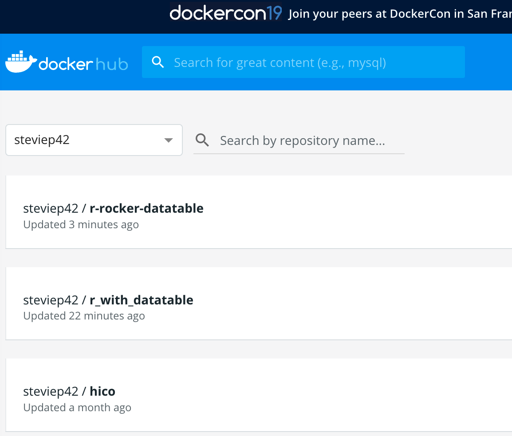

# Dockers

If using Virtualbox seems too much then consider using "[Docker](https://www.docker.com/)" technology which is a form of lightweight virtualization designed to give users easy access to specific services (e.g. other operating systems, analysis packages, databases,etc) without requiring a full on installation of something like VMWare or Virtualbox. Docker "images" are created by a community of interested users who then publish these images onto a repository or registry, usually [Dockerhub](https://hub.docker.com/), for use by others. Running them involves first installing the Docker software for your operating system and then issuing some commands that pulls down the image and executes it within a "container" that can interact with your local operating system. 

<center>
{width=400}
</center>

## Scenarios 

As an example, let's consider the following scenarios:

1) I'm on a Windows or an Apple laptop and I need an Ubuntu OS to run some software I read about that will only run on Linux. I don't want to install Virtualbox

2) I have R installed on my laptop and it has all the packages I need to do my work.
I read some research paper that points me to a new R package that woild require me to update my version of R but I really don't want to do this. 

3) I am developing an R (or Python) package and I want to share it with my colleagues without requiring them to do install a lot of pre-requisites.

4) I am developing software that has a web server, database, and a front end user facing application. I want to develop this all locally without having to involve system administrators and other people. 

Docker solves these problems. It's not the only solution but it is becoming incresasingly popular to develop and design applications to run inside of light weight "containers" that sit on top of you OS without interfering with it. 

Let's look at scenario number one again: 

1) I'm on a Windows or an Apple laptop and I need an Ubuntu OS to run some software I read about that will only run on Linux. I don't want to install Virtualbox

Here is the Docker solution. This is using my Apple laptop.

```{r eval=FALSE}
$ docker run -it ubuntu
Unable to find image 'ubuntu:latest' locally
latest: Pulling from library/ubuntu
898c46f3b1a1: Pull complete 
63366dfa0a50: Pull complete 
041d4cd74a92: Pull complete 
6e1bee0f8701: Pull complete 
Digest: sha256:017eef0b616011647b269b5c65826e2e2ebddbe5d1f8c1e56b3599fb14fabec8
Status: Downloaded newer image for ubuntu:latest
root@85455cbcf54d:/# ls
bin  boot  dev  etc  home  lib  lib64  media  mnt  opt  proc  root  run  sbin  srv  sys  tmp  usr  var
root@85455cbcf54d:/# uname -a
Linux 85455cbcf54d 4.9.125-linuxkit #1 SMP Fri Sep 7 08:20:28 UTC 2018 x86_64 x86_64 x86_64 GNU/Linux
root@85455cbcf54d:/# 


```

2) I have R installed on my laptop and it has all the packages I need to do my work.
I read some research paper that points me to a new R package that woild require me to update my version of R but I really don't want to do this. 


```{r eval=FALSE}
Steves-MacBook-Pro:~ esteban$ docker run -it rocker/r-base
Unable to find image 'rocker/r-base:latest' locally
latest: Pulling from rocker/r-base
71c170c5dae2: Pull complete 
1b76173b98c5: Pull complete 
1b00be862536: Pull complete 
c48ed365264c: Pull complete 
b2f3e26a95d6: Pull complete 
bdb9fc7fc7fb: Pull complete 
Digest: sha256:0589141389482d3211dbc9ccef20e1b426cc8ed7644c2ef0f60862becf3bea4e
Status: Downloaded newer image for rocker/r-base:latest

R version 3.5.3 (2019-03-11) -- "Great Truth"
Copyright (C) 2019 The R Foundation for Statistical Computing
Platform: x86_64-pc-linux-gnu (64-bit)

R is free software and comes with ABSOLUTELY NO WARRANTY.
You are welcome to redistribute it under certain conditions.
Type 'license()' or 'licence()' for distribution details.

  Natural language support but running in an English locale

R is a collaborative project with many contributors.
Type 'contributors()' for more information and
'citation()' on how to cite R or R packages in publications.

Type 'demo()' for some demos, 'help()' for on-line help, or
'help.start()' for an HTML browser interface to help.
Type 'q()' to quit R.

> 

```

Dockers are far more light weight than VMs. Think of it this way:

> If you have 30 Docker containers that you want to run, you can run them all on a single virtual machine (or real machine). To run 30 virtual machines, you’ve got to boot 30 operating systems with at least minimum resource requirements available before factoring the hypervisor for them to run on with the base OS.

https://blog.codeship.com/why-docker/

> Containers work a little like VMs, but in a far more specific and granular way. They isolate a single application and its dependencies—all of the external software libraries the app requires to run—both from the underlying operating system and from other containers. 

https://www.infoworld.com/article/3310941/why-you-should-use-docker-and-containers.html

## Differences From VMs

Here is a diagram of what a Virtual Server might look like. Notice that there is a "Hypervisor" on top of the host that enables you to install and maintain multiple operating systems. See [this link](https://medium.freecodecamp.org/a-beginner-friendly-introduction-to-containers-vms-and-docker-79a9e3e119b) from which the following graphics were taken for more discussion for more discussion

<center>
{width=500}
</center>

And here is the diagram for a container / Docker approach:

{width=500}


Lastly, we have a diagram of the Docker Universe. What this means to you is that you will install the Docker software for your computer which then executes a **daemon** (a persistent process) that can communicate with Docker Hub to identify and obtain existing images that you can run locally. You can develop images and then push them up to Docker Hub (as you would with GitHub for general source code)
for others to use. 

{width=450}

## Docker Terminology

The terminology is pretty easy and straightforward. Docker hub is a free (for the most part) registry service to maintain Docker images thats can be **pulled** down to your computer. You can then run the images inside of **containers**. There are commands to develop your own images that can be executed in containers which can **talk** to each other where desired. Of course there are commands that allow you to find, execute, and maintain images and containers as well as develop them. Go to the Docker site and install the code for your platform. 

### Images

You can pull an image. Once it's been downloaded it will stay local unless you make and effort to remove it. Think of an image as read-only package that has whatever you need to do something.


```{r eval=FALSE}
# Show current docker activity on your machine

$ docker ps
CONTAINER ID        IMAGE               COMMAND             CREATED             STATUS              PORTS               NAMES

# Show all activity (past and present)

$ docker ps -a
CONTAINER ID  IMAGE   COMMAND       CREATED            STATUS  PORTS  NAMES
85455cbcf54d  ubuntu  "/bin/bash"   About an hour ago   Exited (0) 2 minutes ago                       keen_wright

$ docker image ls
REPOSITORY  TAG                 IMAGE ID            CREATED             SIZE
ubuntu      latest              94e814e2efa8        3 weeks ago         88.9MB

```


You can search for images based on what they do.

```{r eval=FALSE}
$ docker search python
NAME        DESCRIPTION         STARS               OFFICIAL            AUTOMATED
python      Python is an interpreted, interactive, objec…   4026              [OK]                
django    Django is a free web application framework, …   805                 [OK]                
pypy      PyPy is a fast, compliant alternative implem…   175                 [OK]                
kaggle/python Docker image for Python scripts run on Kaggle   114             [OK]

frolvlad/alpine-python3   The smallest Docker image with Python 3.5 (~…   96  [OK]

```


Let's look for a images that have the R tidyverse, Rstudio, and Shiny. There is a project called "rocker" that has almsot all the cool R stuff you would want in the form of a Docker image. 

```{r eval=FALSE}
$ docker search rocker | grep shiny                                 
rocker/shiny-verse  Rocker Shiny image + Tidyverse R packages. U…  

$ docker search rstudio

NAME  DESCRIPTION                                     STARS               OFFICIAL            AUTOMATED
rocker/rstudio                        RStudio Server image                            243                                     [OK]
opencpu/rstudio                       OpenCPU stable release with rstudio-server (…   29                                      [OK]
rocker/rstudio-stable                 Build RStudio based on a debian:stable (debi…   14                                      [OK]

```

So someone went ahead and made images with all that you need to run these packages. When we run this we have to tell the image what password we want to provide for the rstudio password. The **rm** option tells docker to remove the image once we are done using the image. 

```{r eval=FALSE}
$ docker run --rm -e PASSWORD='steve' -p 8787:8787 rocker/verse
```

That's great and all but how then does the Docker image interact with the local filesystem on your laptop ? First, let's stop the running container


```{r eval=FALSE}
docker ps 
CONTAINER ID        IMAGE               COMMAND             CREATED             STATUS              PORTS                    NAMES
292adbfaa2e1        rocker/verse        "/init"             3 hours ago         Up 3 hours          0.0.0.0:8787->8787/tcp   optimistic_cori

$ docker stop optimistic_cori
optimistic_cori

```

I'm on an Apple so I want my home folder to be available on the Rstudio server under the directory as /home/esteban

```{r eval=FALSE}
$ docker run --rm -v /Users/esteban:/home/esteban -e PASSWORD='steve' \
     -p 8787:8787 rocker/verse 
```


## RShiny

Note that the "rocker" project has lots of Docker stuff relative to R. Check out https://github.com/rocker-org/shiny for more information. So let's see within my home folder I have a folder with Server.R and UI.R files. This is a very simple application. Let's look at the content of the files:

```{r eval=FALSE}

$ cd appdir/
$ ls
Server.R	UI.R

$ cat Server.R 
# Define server logic required to print "Hello World" when button is clicked
shinyServer(function(input, output) {
  
  # Create action when actionButton is clicked
  observeEvent(input$Print_Hello,{

    # Change text of Server_Hello
    output$Server_Hello = renderText("Hello world from server side")
  })
  
  
})

$ cat UI.R

library(shiny)

# Define UI for application print "Hello world" 
shinyUI(

  # Create bootstrap page 
  fluidPage(
    
    # Paragraph "Hello world"
    p("Hello world"),

    # Create button to print "Hello world" from server
    actionButton(inputId = "Print_Hello", label = "Print_Hello World"),

    # Create position for server side text
    textOutput("Server_Hello")
    
  )
)

```

Now let's run a Shiny Server

```{r eval=FALSE}
$ docker run -p 3838:3838 -v /Users/esteban/appdir/:/srv/shiny-server/ rocker/shiny

```

Nezt let's lood the Shiny App

{width=500}

## Making Your Own Image

The last thing we will discuss is how to build upon an existing image to create your own image that you
could then publish to Docker Hub to distribute to others. Let's use one of the rocker images as a base
for installing some specific packages. This will be a trivial example but you could make significant 
additions to an image if you wanted to. The advantage of this approach is that you don't have to 
build everything from scratch. For example, let's 

1) Run the rocker/verse image
2) Install a package (e.g. data.table)
3) Commit the changes to the image
4) Give it a new name 
5) Push our new image up to Docker hub.

```{r eval=FALSE}
# This will launch an Rstudio session from which we can install the data.table package
$ docker run --rm -e PASSWORD='steve' -p 8787:8787 rocker/verse

```

So now we will commit changes to this image since the next time we start it we would like for it to 
have the data.table package already installed. This is a basic example but imagine if we had installed
a lot of packages. We wouldn't want to do this every time. 

```{r eval=FALSE}
# Get the Container ID
$ docker ps | awk '{print $1," ",$2}'
CONTAINER   ID
439385c073f8   rocker/verse

# Commit the changes we made to it (i.e. the package install)
$ docker commit 439385c073f8 steviep42/r-rocker-datatable
sha256:f75857b7fb0060c31cbead22fdc6e37dc341bcea111b570d990d1b31cb88d67f
(base) Steves-MBP:~ esteban$ docker push steviep42/r-rocker-datatable
The push refers to repository [docker.io/steviep42/r-rocker-datatable]
15b389285a52: Pushed 
d466632838cf: Mounted from rocker/verse 
395ecd3ce103: Mounted from rocker/verse 
23fc0d314261: Mounted from rocker/verse 
9142a472c042: Mounted from rocker/verse 
2b40fab709d4: Mounted from rocker/verse 
f453344be0c3: Mounted from rocker/verse 
0fef5c3c51c6: Mounted from rocker/verse 
e8481c9f7465: Mounted from rocker/shiny 
fbb641a8b943: Mounted from rocker/tidyverse 
latest: digest: sha256:368dd8950a433cc14ba799f6c4a39b812eff904b670563fd33ecad64d8a61c85 size: 2422


```

{width=550}


## There is Another Way

We can create what is known as a Dockerfile which can contain the instructions to do what we did above except
in a more convenient way. Make a folder called **build**. Note that this is arbitrary.

```{r eval=FALSE}
$ mkdir build
$ cd build

# This next step will create a file called Dockerfile
$ vi Dockerfile
```

Give your Docker file the following contents

```{r eval=FALSE}
FROM rocker/verse:latest

RUN  echo 'install.packages(c("data.table"), \
repos="http://cran.us.r-project.org", \
dependencies=TRUE)' > /tmp/packages.R \
  && Rscript /tmp/packages.R

EXPOSE 8787 
```

Next, we can build a new image that is based on rocker/verse:latest. This is cool because we don't have to go to the trouble of installing all the underlying packages used to make that image. We just build on what we already have.

```{r eval=FALSE}
$ docker build -t steviep42/test .
Sending build context to Docker daemon  2.048kB
Step 1/3 : FROM rocker/verse:latest
 ---> ed004402fcbc
Step 2/3 : RUN  echo 'install.packages(c("data.table"), repos="http://cran.us.r-project.org", dependencies=TRUE)' > /tmp/packages.R   && Rscript /tmp/packages.R
 ---> Using cache
 ---> 518dd192faf4
Step 3/3 : EXPOSE 8787
 ---> Using cache
 ---> ddf2c7ed59dc
Successfully built ddf2c7ed59dc
Successfully tagged steviep42/test:latest
```

Now we can test it out:

```{r eval=FALSE}
docker run -e PASSWORD='steve' -p 8787:8787 steviep42/test
```


