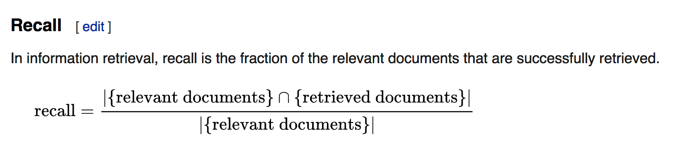
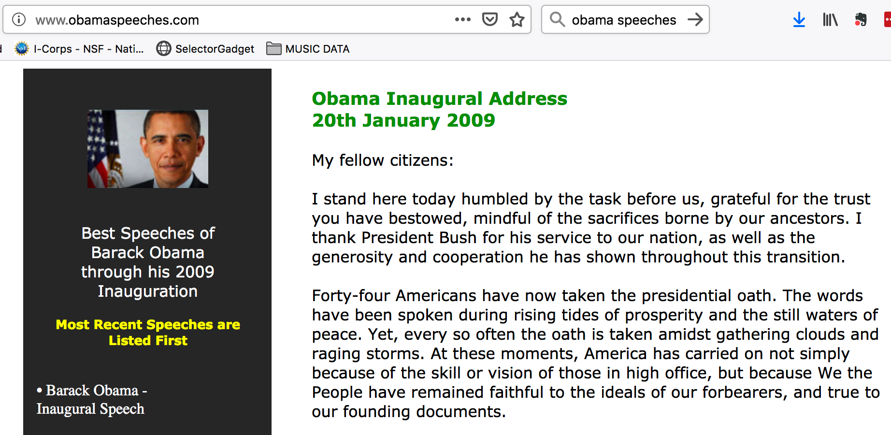

---
output:
  html_document: default
  pdf_document: default
---

# Text Mining

## Recap

In my last lecture I talked about using the **rvest** package to pull data from the Internet. This is useful because there is lots of information out there on the Internet that you could download and analyze. It can also be a pain to clean data and get it into a format you would like but that's life and there isn't a lot you can do about that. 

```{r echo=FALSE}
library(ggplot2)
suppressMessages(library(dplyr))
suppressMessages(library(tidytext))
library(stringr)
library(SnowballC)
library(RColorBrewer)
library(wordcloud)

```

* Every 60 seconds on Facebook: 510,000 comments are posted and 293,000 statused are updated

* Facebook Photo uploads total 300 million per day

* Worldwide, there are over 2.32 billion active Facbook users as of December 31, 2018

* Every second, on average, around 6,000 tweets are tweeted on Twitter 

* 1,332,433 Publications in Pubmed for the year 2018


Here are the top Twitter accounts being followed. A tweet from any of these people can represent a lot of money ! There are people who try to figure out just how much.

 

<center>

</center>

Sources: 

* https://zephoria.com/top-15-valuable-facebook-statistics/
* http://www.internetlivestats.com/twitter-statistics/
* http://dan.corlan.net/cgi-bin/medline-trend?Q=

## Unstructured Data

Much of the text information found in these sources is **unstructured** meaning that the content is a narrative, a collection of phrases, or maybe social media posts that might involve domain specific references or a form of slang. Not surprisingly, it can be hard to get meaningful information from text. Unstructured data is useful in that can capture many contexts or points of views in response to a question or situation. It's also more "natural" for humans to speak and write in unsrtuctured terms. 

<center>
{width=450}
</center>

http://www.triella.com/unstructured-data/

Some **unstructured** text does conform to an ontology, vocabulary, or some form of domain approved terminology that can simplify knowledge extraction but there are always ambiguities. For example consider a body (aka "corpus") of medical information related to Nephrology. The following terms might be used to refer to the same thing:

* Chronic renal impairment
* Chronic kidney disease
* CKD
* Kidney failure
* Chronid renal failure
* CRF
* Chronic renal failure syndrome
* Renal insufficiency
* eGFR 44


Source: http://healtex.org/wp-content/uploads/2016/11/I4H-Healtex-tutorial-part1-optimised.pdf

Unless someone knows that these all map to the same idea then downstream analysis might lead to confusing or diluted results. 

## Structured Data

Stuctured data is easier to work with in the sense that it is frequently numeric in nature so it lends itself well to statistical analysis and use in building predictive models. Some structured data is standalone meaning you can download it or obtain it as a .CSV file or from a database (e.g. CDC) and begin to work with the data immediately upon receipt.

However, structured data does NOT have to be numeric. For example, consider demographic information. As long as a patient tracking system conforms to a standard then one's race (and the label used to describe that) would ususally not change. Lists of personal allegies and medications are ususally structured although they might change over time. Smoking status ("yes" or "no") is structured. Asking someone to describe their life time struggles with trying to stop smoking would not be structured information. 

## Hybrids

Consider a Pubmed publication. There is a lot of textual information that is supplemented by graphs, tables, and (hopefully) link outs to raw data. Of course the tables themselves represent a form of structured data in aggregate form so you maybe you would want to parse tor extraxt them from the text. Also consider that Clinician notes and letters are ususally in narrative form but might well include structured info also.

> The take home info here is that there is by far more **unstructured** data than **structured** but there is lots of cool stuff to be learned from unstructured information. So don't let that stop you from trying to apply text mining methods for understanding collections of documents.

## Information Retrieval vs Information Extraction

Searching for data is different from extracting meaning from the results returned from a search. If a search engine is good it will return relevant results in response to our query. 
A bad search engine will return lots of "false positives". The idea of **relevance** can be expressed using a number of mathematically computed ratios such as **precision** (aka **positive predictive value**) and **recall** (aka **sensitivity**). We'll dig more into these later.



https://en.wikipedia.org/wiki/Precision_and_recall


So for this lecture we'll assume that we have some meaningful results already and work with the text that we have (or will) obtain from using some web scraping techniques we used in a previous lecture. 


## Web Scraping Revisited

So I just said that we would be focusing on how to compute on the data instead of how to retrieve it but it's important to review some basic techniques to refresh your memory and up your R game a little bit. Let's get some speeches given by former President Obama. This is easy to do. 

Look at this URL http://www.obamaspeeches.com/




We can get all the speeches from this page if we want to using the **rvest** package. It's tedious and takes some time to get things to work correctly but it's not intellectually challenging. Data scraping and cleaning are two of the more common tasks when working with unstructured text. There is no way around it really. Most projects start out with lots of enthusiam until the data starts rolling in and everyone realizes that there are problems with formatting, etc. Anyway, we'll get a list of all the links from the page itself. Well all the links that refer to a speech. 

```{r}
library(rvest)
url <- "http://www.obamaspeeches.com/"

links <- read_html(url) %>% html_nodes("a") %>% html_attr("href") 
links[c(1:2,110:114)]
```


So there are about 114 speeches but the last couple of elements don't appear to relate to the speeches so we'll pull them from the list:

```{r}
links[c(length(links)-3):length(links)]
```

I'm going to formalize this a bit more and make it better because it turns out that some of the speech links on that page are duplicated. Besides, I also want to get back the full link so I can access it and download the text. 

```{r}
linkScraper <- function(baseurl="http://obamaspeeches.com") {
#
# Function to grab links from the Obama Speech site
# http://obamaspeeches.com/
#
  suppressMessages(library(rvest))

  url   <- "http://obamaspeeches.com/"
  links <- read_html(url) %>% html_nodes("a") %>% html_attr("href")
  
  links <- gsub("/","",links)
  cleaned_links <- links[-grep("http",links)]
  
  cleaned_links <- cleaned_links[!duplicated(cleaned_links)]
  
  retlinks <- paste("http://obamaspeeches.com",cleaned_links,sep="/")
  return(retlinks)
}
```

```{r}
obamalinks <- linkScraper() 

obamalinks[3:10]
```

Now let's get the actual speech content. Not only will we get the speech content but we will keep track of the specific speech number from whence the text came. So we will create a factor that let's us identify each speech by a number. We don't have to do this if we want to consider all the speeches text as one big "blob". 

```{r}
obamaParse <- function(url,write=FALSE) {
  library(rvest)
  retlist <- list()
  df <- data.frame()
  
  for (ii in 1:length(url)) {
    page <- read_html(url[ii]) %>% html_nodes("p") %>% html_text()
    
    # The following gets rid of some links that don't work. See, this is
    # the crap you have to deal with when working with real data
    
    val <- grep("Against the Iraq",page)
    page <- page[-1:-val]
  
    # Now we also want to get rid of numbers since they generally 
    # don't mean very much in text analysis.
    
    page_nonum <- as.vector(lapply(page,function(x) gsub("[0-9]+","",x)))
    
    # We populate each list element with a one line data frame which 
    # contains the text of one speech and its associated "book" number
    # e.g. 1,2,3... for the length of the url argument
    
    retlist[[ii]] <- data.frame(text=page,book=as.character(ii),
                                stringsAsFactors = FALSE)
    # Return the page
  }
  df <- do.call(rbind,retlist)
  return(df)
}
```


Let's get just 9 speeches to make things manageable. 


```{r}
out <- obamaParse(obamalinks[2:12])
```


```{r}
speeches <- out %>% group_by(book) %>% 
  mutate(linenumber = row_number()) %>% ungroup()

speeches
```

## Exploring The Text

So there are some general activities common to text explorations. Let's summarize:

1) Collections of text (one or more documents) can be called a **corpus** 
2) We tend to break up documents into words and treat them as a **bag of words**
3) Getting the text into a tidy format is importnat. The **tidytext** package helps.
4) Basically we get each word of a phrase or document onto its own line a data frame
5) We then remove **stop words** which are **filler** words that don't mean much
6) We might also get rid of numbers 
7)  Next, we **stem** the words (e.g. america and americas are really the same word)

The **tidytext** package is what we will use here although there a number of R packages that take a more traditional approach to analyzing text such as the **tm** package. There is also **RWeka** and the **qdap** packages that help work with text data. 

You might also encounter references to things like **Term Document Matrices** or **Document Term Matrices** which are sparse matrix structures that help count the number of times a word occurs in a given set of documents. The transpose of a **Document Term Matrix** can be thought of as a **Document Term Matrix**. 


Here is a very brief walkthrough on how you could do some text explorations using the **tm** package:

```{r}

# https://stackoverflow.com/questions/24703920/r-tm-package-vcorpus-error-in-converting-corpus-to-data-frame#24704075

suppressMessages(library(tm))
library("wordcloud")
library("RColorBrewer")

# Create a vector with text
x <- c("Hello. Sir!","Tacos? On Tuesday?!?", "Hello")

# We create a Corpus
mycorpus <- Corpus(VectorSource(x))

# Get rid of the punctuation
mycorpus <- tm_map(mycorpus, removePunctuation)

# Create a Term Document Matrix
dtm <- TermDocumentMatrix(mycorpus)

# We can turn it onto a matrix to be read by humans
m <- as.matrix(dtm)
v <- sort(rowSums(m),decreasing=TRUE)
d <- data.frame(word = names(v),freq=v)
head(d, 10)


set.seed(1234)
wordcloud(words = d$word, freq = d$freq, min.freq = 1,
          max.words=200, random.order=FALSE, rot.per=0.35, 
          colors=brewer.pal(8, "Dark2"))
```


https://gerardnico.com/natural_language/term_document

The strengths of **tm** are that it more closely aligns with the traditional text mining terminology and approaches. There are also a number of tools and packages that work well with **tm** that do not work well directly with the **tidytext** approach. But there are now approaches and functions in **tidytext** that address this concern which can take, for example, a **Term Document Matrixx** and turn it into a tidy data frame. 


### Tidy Format

In this class you have encountered previous references the **tidyverse** and tools such as those found in **dplyr**. It shouldn't be surprising then that the **tidytext** package has text analysis tools that fit in nicely with the **tidyverse**. 

### Tidy Up the text

Let's look at the speeches data frame

```{r}
speeches
```

This looks bad because the text still has junk characters in it. Each row also has a long stringy line of text (in the **text** column) that is not only hard to read but if we wanted to compute on the text it would be very inconvenient. It might better to first break up the long obnoxious looking line into individual words. 

```{r}
library(tidytext)
tidy_speeches <- speeches %>%
  unnest_tokens(word, text)

tidy_speeches
```

### Dump The "Stop Words"

So we have some more work to do. Let's get rid of common words that don't substantially add ot the comprehensibility of the information. There is a built in data frame called **stop_words** that we can use to filter out such useless words (well for purposes of information retrrieval anyway).

```{r}
data(stop_words)

tidy_speeches_nostop <- tidy_speeches %>%
  anti_join(stop_words)
```

### Eliminate Numbers

Let's also remove numbers from the words.

```{r}
# remove numbers
nums <- tidy_speeches_nostop %>% 
  filter(str_detect(word, "^[0-9]")) %>% 
  select(word) %>% unique()

tidy_speeches_nostop_nonums <- tidy_speeches_nostop %>% 
  anti_join(nums, by = "word")
```


```{r}
tidy_speeches_nostop_nonums %>%
  count(word, sort = TRUE) 
```

### Stemming 

Some of these words need to be "stemmed" - such as "american" and "americans". There is a function in the **snowballC** package that will allow us to do this. Here is an example. 

```{r}
some_words <- c("america","americas","american","cat","cats","catastrophe")
wordStem(some_words)
```


```{r}

tidy_speeches_nostop_nonums_stem <- tidy_speeches_nostop_nonums %>% 
                mutate(word_stem = wordStem(word)) 

tidy_speeches_nostop_nonums_stem
```

### Bar Plots

```{r}
library(ggplot2)

tidy_speeches_nostop_nonums_stem %>%
  count(word_stem, sort = TRUE) %>% filter(n > 40) %>%
  mutate(word_stem = reorder(word_stem, n)) %>%
  ggplot(aes(word_stem, n)) +
  geom_col() +
  xlab(NULL) +
  coord_flip()
```


http://jacobsimmering.com/2016/11/15/tidytext/

```{r}
library(tidyr)

frequency <- tidy_speeches_nostop_nonums_stem %>% 
  count(book,word_stem) %>%
  group_by(book) %>%
  mutate(proportion = n / sum(n)) %>% 
  select(-n) %>% 
  spread(book, proportion) %>% 
  gather(book, proportion, `1`:`9`)
```


```{r}
tidy_speeches_nostop_nonums_stem %>% count(book,word_stem,sort=TRUE) %>% 
  filter(n > 14) %>% 
  ggplot(aes(word_stem, n)) +
  geom_col() +
  xlab(NULL) +
  coord_flip() + facet_grid(book ~ .)

```

```{r}
tidy_speeches_nostop_nonums_stem %>% count(book, word_stem, sort = TRUE) %>%
  group_by(book) %>%
  top_n(5) %>% 
  ungroup() %>%
  ggplot(aes(reorder_within(word_stem, n, book), n,fill = book)) +
  geom_col(alpha = 0.8, show.legend = FALSE) +
  scale_x_reordered() +
  coord_flip() +
  facet_wrap(~book, scales = "free") +
  scale_y_continuous(expand = c(0, 0)) +
  labs(
    x = NULL, y = "Word count",
    title = "Most frequent words after removing stop words"
  )
```

https://richpauloo.github.io/2017-12-29-Using-tidytext-to-make-word-clouds/


### Wordclouds

One of the premier visualizations for text documents is the **word cloud**. You see this a lot in newsletters and on flyers since word clouds show you frequently occurring topics in a way that makes it obvious what the most mentioned words are. 

```{r}
pal <- brewer.pal(8,"Dark2")

# plot the 50 most common words

tidy_speeches_nostop_nonums_stem %>%
  count(word_stem, sort = TRUE) %>%
  with(wordcloud(word_stem, n, random.order = FALSE, max.words = 50, colors=pal))
```

See https://shiring.github.io/text_analysis/2017/06/28/twitter_post


## Term Frequency

As mentioned in the previous section, much of the content of a collectio of text contains lots of "filler" words such as "the","a","an","as","is","at","which". Identifying these words is important in text mining and in search engine technology since you generally want to avoid them as they can interfere with a getting a good result. Stop words are also language dependent. 

Moreover, a given domain also has stop words. For example, when considering documents or tweets that mention kidney disease you might want to filter out specific references to "kidney disease" since you already know that you are considering kidney disease. So you might want to remove those obvious references and drill down into other words and phrases that might be important. 

<center>
{width=500}
</center>
https://dev.mysql.com/doc/refman/5.5/en/fulltext-stopwords.html


### Back To The Speeches

Let's look at some examples of term frequency using collections of speeches from Obama and Romney when they were both candidates. I have two folders with 50 speeches each.

```{r}
library(readtext) # Makes it easy to read in raw text files

# We have a folder with about 50 Obama Speeches

setwd("~/Downloads/Candidates/OBAMA")
filenames <- list.files( pattern="*", full.names=TRUE)
suppressWarnings(obama <- lapply(filenames, readtext))
collected_obama <- sapply(obama,function(x) x$text) 
length(collected_obama)

# Now Let's get this into tidy text. We will also put a column
# that marks the text with its respective source ("Obama","Romney")

obama_df <- tibble(line=1:length(collected_obama),
                   text=collected_obama,
                   book="obama")

# Let's tidy this up in accordance with tidy principles

tidy_obama_df <- obama_df %>%
  unnest_tokens(word, text)

tidy_obama_df
```


Next we will do the same for the Romney speeches. 


```{r}
# We have about 50 speeches from Romney

setwd("~/Downloads/Candidates/ROMNEY")
filenames <- list.files( pattern="*", full.names=TRUE)
suppressWarnings(romney <- lapply(filenames, readtext))
collected_romney <- sapply(romney,function(x) x$text) 
length(collected_romney)

# Now Let's get this into tidy text
rom_df <- tibble(line=1:length(collected_romney),
                 text=collected_romney,
                 book="romney")

tidy_romney_df <- rom_df %>%
  unnest_tokens(word, text)

# Let's combine the two data frames

combined_tidy_speech <- rbind(tidy_obama_df,tidy_romney_df)

# Count the total number of speech words per candidate

combined_tidy_speech %>% group_by(book) %>% summarize(count=n())

```

Next we'll count the number of times each word occurs within speeches for each candidate:

```{r}
# Get number of times a word occurs within a speech
# per candidate

book_words <- combined_tidy_speech %>% 
  count(book, word, sort=TRUE)

# Get the total number of words in each speech collection
total_words <- book_words %>% 
  group_by(book) %>% 
  summarize(total = sum(n))

```


So now we can join these two data frames. What we get for our trouble is way to compute the frequency of a given term within each speech collection for each candidate. This provides information on what terms occur with great frequency and those that do not. We can plot these. 

```{r}
book_words <- left_join(book_words, total_words)

book_words
```

```{r}
library(ggplot2)

ggplot(book_words, aes(n/total, fill = book)) +
  geom_histogram(show.legend = FALSE) +
  xlim(NA, 0.0009) +
  facet_wrap(~book, ncol = 2, scales = "free_y")

```


## Tf and Idf

> A central question in text mining and natural language processing is how to quantify what a document is about. One measure of how important a word may be is its term frequency (tf), how frequently a word occurs in a document

We could use a list of stop words but it's not always the most sophisticated approach to adjusting term frequency for commonly used words.

> Another approach is to look at a term’s inverse document frequency (idf), which decreases the weight for commonly used words and increases the weight for words that are not used very much in a collection of documents. This can be combined with term frequency to calculate a term’s tf-idf (the two quantities multiplied together), the frequency of a term adjusted for how rarely it is used. t-idf similarity

https://www.tidytextmining.com/tfidf.html

> The statistic tf-idf is intended to measure how important a word is to a document in a collection (or corpus) of documents, for example, to one novel in a collection of novels or to one website in a collection of websites. 

We can use the **bind_tf_idf** function to compute tf, and idf for us. Furthermore it will bind this information onto a tidy text data frame. 

```{r}
book_words <- book_words %>%
  bind_tf_idf(word, book, n)
book_words

```

Let's look at a sorted list get the high tf_idf words

```{r}
book_words %>%
  select(-total) %>%
  arrange(desc(tf_idf))
```


We can plot this information

```{r}
book_words %>%
  arrange(desc(tf_idf)) %>%
  mutate(word = factor(word, levels = rev(unique(word)))) %>% 
  group_by(book) %>% 
  top_n(15) %>% 
  ungroup() %>%
  ggplot(aes(word, tf_idf, fill = book)) +
  geom_col(show.legend = FALSE) +
  labs(x = NULL, y = "tf-idf") +
  facet_wrap(~book, ncol = 2, scales = "free") +
  coord_flip()
```


```{r}
data(stop_words)

book_words %>%
  arrange(desc(tf_idf)) %>%
  mutate(word = factor(word, levels = rev(unique(word)))) %>% 
  group_by(book) %>% 
  top_n(15) %>% 
  ungroup() %>%
  ggplot(aes(word, tf_idf, fill = book)) +
  geom_col(show.legend = FALSE) +
  labs(x = NULL, y = "tf-idf") +
  facet_wrap(~book, ncol = 2, scales = "free") +
  coord_flip()

```

## Sentiment

Attempting to understand the feeling associated with words is a complicated business especially given that context can drastically change the meaning of words and phrases. Consider the following statements. To a human the sentiment is obvious. The third statement reflects sarcasm which is notoriously difficult for an algorithm to pick up. 

```{r eval=FALSE}

I had a good flight experience on Delta airlines.

I had a bad flight experience on Delta airlines.

Gee thanks Delta for losing my luggage.

```

### Sentiment Dictionaries and Lexicons

The **tidytext** package has a data frame called **sentiments** which has three lexicons that will help us figure out the emotional value of words. Each dictionary handles sentiment assessment differently. 

The **nrc** dictionary applies a single word emotional description to a text word
Of course a word in a piece of text can be associated with different emotions. The possible sentiments are:
  
```{r}
unique(get_sentiments("nrc")$sentiment)
```

Next there is the the **afinn** dictionary which presents a range of scores from -5 to 5 which coincides with a range of negative to positive emotion - although the rating is "stepped" (i.e. integers). 

```{r}
get_sentiments("afinn") %>% head(.)
get_sentiments("afinn") %>% select('score') %>% range(.)
```

The **bing** lexicon offers a binary assessment of emotion. It's either "negative" or "positive" so there is no continuum of emotion. 

```{r}
unique(get_sentiments("bing")$sentiment)

#
get_sentiments("bing") %>% head()

```

So next up there is the **loughran** lecxicon which is appropriate for financial and business contexts:

```{r}
unique(get_sentiments("loughran")$sentiment)
```

### An Example

```{r}
head(sentiments)

txt <- c("I had a good flight experience on Delta airlines",
  "I had a bad flight experience on Delta airlines",
  "Gee thanks Delta for losing my luggage")

df <- tibble(1:length(txt),text=txt)
df <- df %>% unnest_tokens(word,text)

# We get rid of the stop words and then see what the nrc sentiment
# dictionary tells us about our data

df %>% anti_join(stop_words) %>% left_join(get_sentiments("nrc"))

df %>% anti_join(stop_words) %>% left_join(get_sentiments("bing"))

df %>% anti_join(stop_words) %>% left_join(get_sentiments("afinn"))

```

### Speech Sentiment 

Let's apply our new found knowledge of sentiment tools to the combined speeches of Romney and Obama. We might want to get some sense of how emotive their respective sets of speeches are. We might also want to look at the emotive range for all speches combined independently of the candidate. Of course, these are political speeches so you know up front that there will be a bias towards positive language. 
So here we will join the words from all speeches to the **bing** sentiment lexicon to rate the emotional content of the words comprising the speech. Note that many words in the speeches will not have an emotional equivalent because they don't exist in the lexicon. This is why you should use a stop word approach or consider using a Term Frequency - Inverse frequency approach to first eliminate filler words. 

```{r}
 bing_word_counts <- combined_tidy_speech %>%
  inner_join(get_sentiments("bing")) %>%
  count(book, word, sentiment, sort = TRUE) %>%
  ungroup()
```

So let's look at some of the emotional content of the speeches independently of candidate (i.e. all speeches combined).

```{r}
bing_word_counts %>%
  group_by(sentiment) %>%
  top_n(15) %>%
  ungroup() %>%
  mutate(word = reorder(word, n)) %>%
  ggplot(aes(word, n, fill = sentiment)) +
  geom_col(show.legend = FALSE) +
  facet_wrap(~sentiment, scales = "free_y") +
  labs(y = "Contribution to sentiment",
       x = NULL) +
  coord_flip()
```


It's also really easy to look at the emotions for each candidate just by using the **book** variable from the **bing_word_counts** data frame. 

```{r}
bing_word_counts %>%
  group_by(sentiment) %>%
  top_n(15) %>%
  ungroup() %>%
  mutate(word = reorder(word, n)) %>%
  ggplot(aes(word, n, fill = sentiment)) +
  geom_col(show.legend = FALSE) +
  facet_wrap(~sentiment+book, scales = "free_y") +
  labs(y = "Contribution to sentiment",
       x = NULL) +
  coord_flip()
```

So if we look at a word cloud of combined sentiment across all speeches independently of candidate we see the following:

```{r}
pal <- brewer.pal(8,"Dark2")

# plot the 50 most common words

bing_word_counts  %>%
  with(wordcloud(word, n, random.order = FALSE, max.words = 50, colors=pal))
```

### Comparison Cloud

So another thing we can do is to look at a comparison cloud that would give us a word cloud that presents a visualization of the most common postive and negative words. There is a function called **comparison.cloud()** that will accomplish this but it also requires us to do some conversion on our data frame. 

```{r}
library(reshape2)
combined_tidy_speech %>%
  inner_join(get_sentiments("bing")) %>%
  count(word, sentiment, sort = TRUE) %>%
  acast(word ~ sentiment, value.var = "n", fill = 0) %>%
  comparison.cloud(colors = c("gray20", "gray80"),
                   max.words = 100)
```

We could also look at this on a per candidate basis:

```{r}
library(reshape2)
combined_tidy_speech %>%
  inner_join(get_sentiments("bing")) %>% 
  filter(book=="romney") %>%
  count(word, sentiment, sort = TRUE) %>%
  acast(word ~ sentiment, value.var = "n", fill = 0) %>%
  comparison.cloud(colors = c("gray20", "gray80"),
                   max.words = 100)
```

