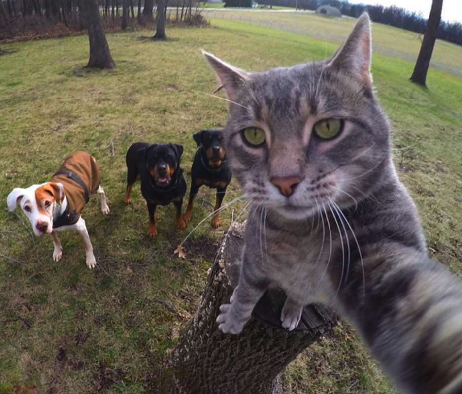
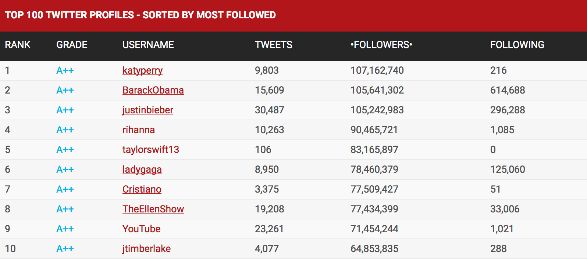
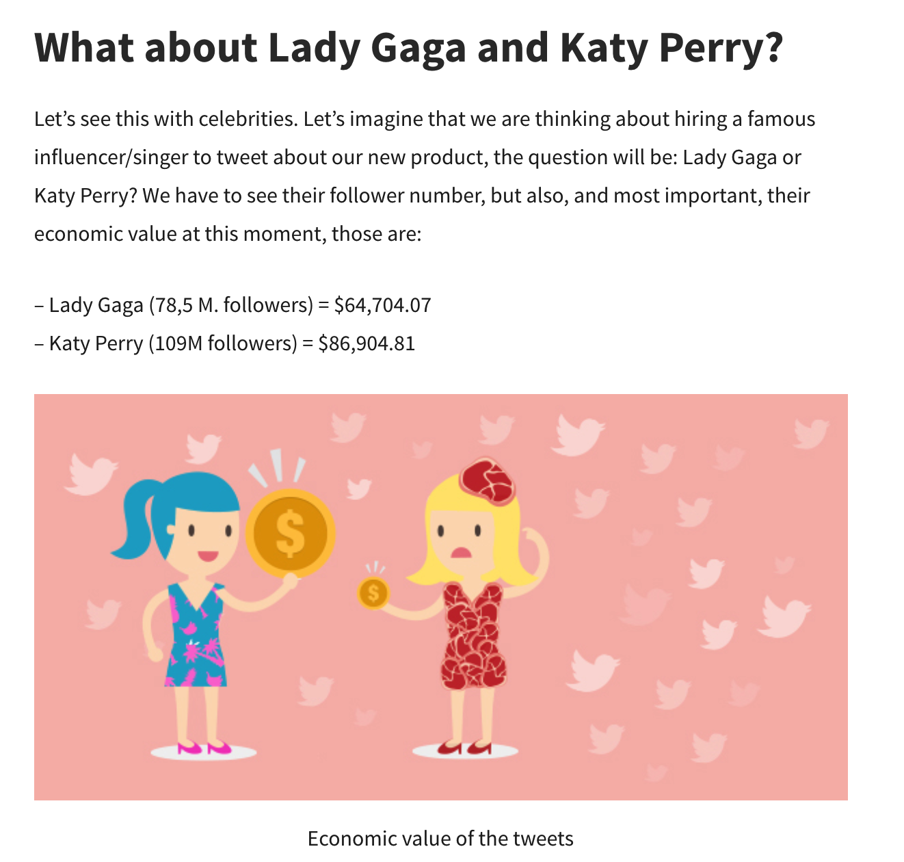
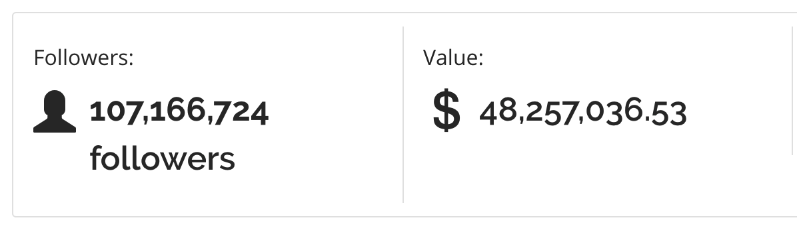
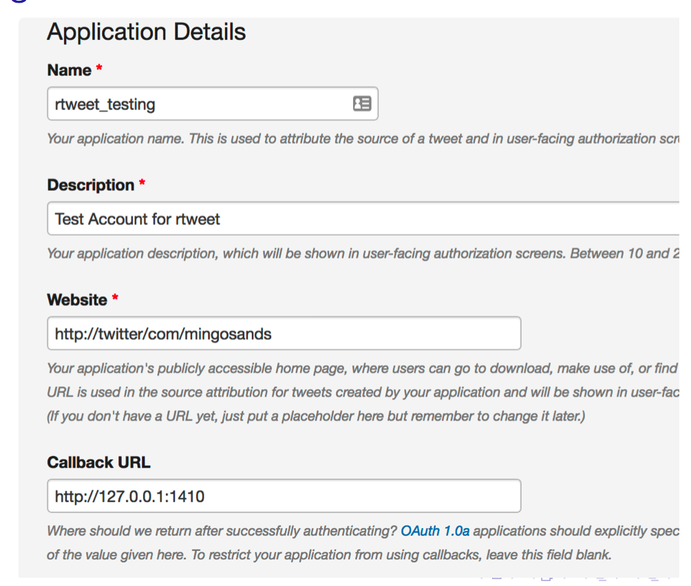
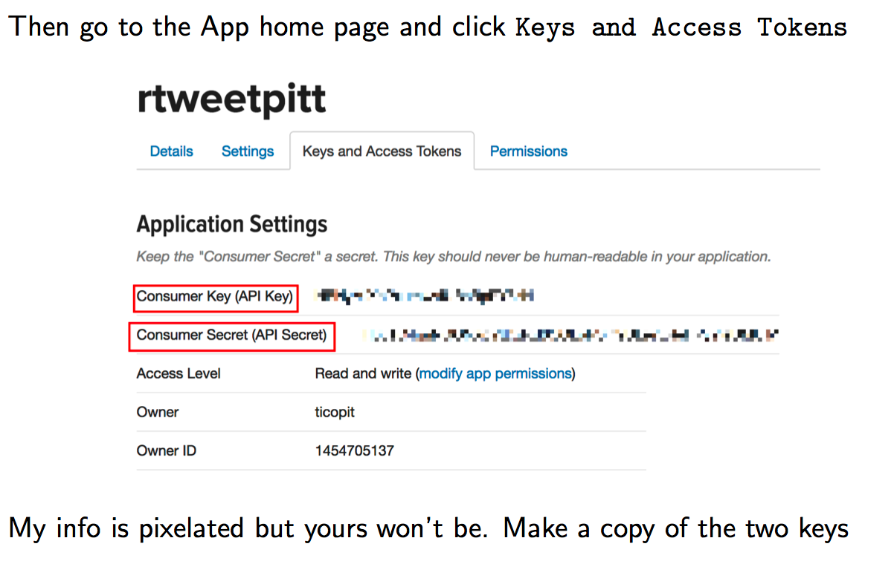
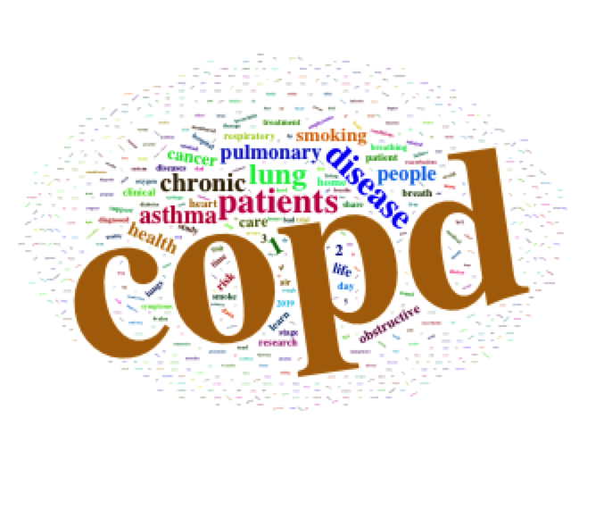
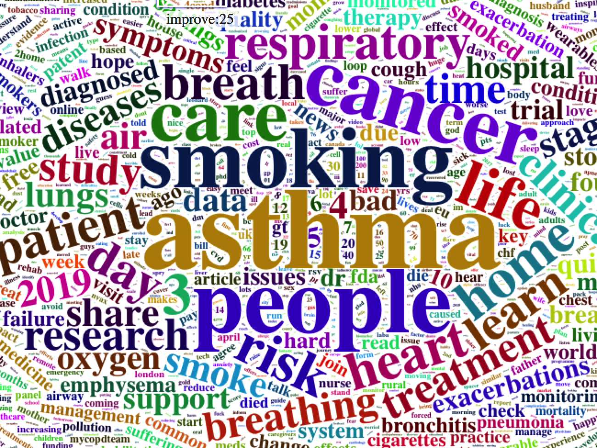
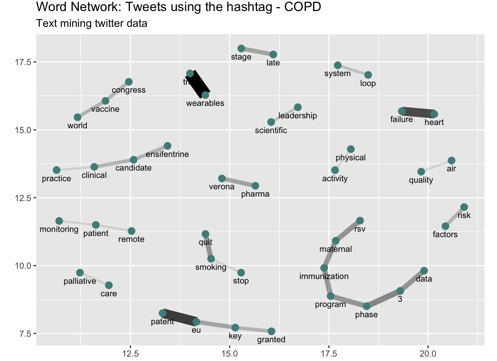

---
output:
  html_document: default
  pdf_document: default
---


# Twitter - Social Media

<center>
{width=450}
</center>


<center>

</center>

## Twitter Uses

* Tweets come from many sources - people, politicians, media outlets, sports teams, movie stars, etc

* Multimedia content can be sent along with a Tweet (pics, movies, emojis)

* Real time communication

* Anyone can create an account and also sign up to use the API

* Proxy news service

## Why Should You Care ?

That's really up to you and your personal interests but consider that tweets can be worth a lot of money. 

<center>



</center>

https://www.freevaluator.com/tools/twitter-username-worth
https://www.tweetbinder.com/blog/economic-value-tweet/

## Twitter Anatomy

* User Name: A unique userid
* Time Stamp: When the tweet went out Text: The content of the tweet
* Hashtags: Words prefixed with a # character.
* Links: Hyper links to other web sourcved
* Replies: Replies to a posted tweet
* Retweets: When someone shares a third party tweet with followers 
* Favorites: A history of tweets you have liked
* Latitude / Longitude: Some tweets have geo coding information

## Accessing From R - rtweet

The **rtweet** package is very cool but you have to do the following:

* Install the rtweet package
* Setup a Twitter account. It’s free at https://twitter.com/

Note that it requires your cell number to create an App (But you can delete the account after the class is over). 

After you have created your account then go http://apps.twitter.com

From with your account create an ”application”so you can mine other tweets:

*  Name: rtweet testing
*  Description: Testing Account for rtweet
*  Website: http://twitter.com/userid (replace userid with your userid)
* Callback URL: http://127.0.0.1:1410
* Create App
 
 <center>

</center>


<center>

</center>

## Authenticating From R

Now within R, You need to do the following. You only need to do it once per session to get authenticated to use Twitter from within R.

```{r eval=FALSE}

# Running this code will contact Twitter and load a web page.
# If authentication is successful then you will see a web page
# with the contents of

library(rtweet)
twitter_token <- create_token(
   app = "rtweetpitt",
   consumer_key = "HBNyMiXbPsdsdiiisdoodvIUBsBpRY8zH",
   consumer_secret = "Tl6uTC4quNGONXsddLoRSIn9ULe7LReHPyYleUMUlM")

```

```{r eval=FALSE}
# Create a Function to Pull in Some Tweets
my_search_tweets <- function(string="Katy Perry",n=500) {
  require(rtweet)
  tweet_table <- search_tweets(string,n=n,
                              retryonratelimit = TRUE,
                              include_rts = FALSE,
                              lang = "en")
  return(plain_tweets(tweet_table$text))
}
raw_tweets <- my_search_tweets("Katy Perry")
katy_raw_tweets <- raw_tweets # save for later

```


```{r eval=FALSE}
[1] "i blame my bad eating habits on katy perry. idk why but i do."

[2] "When I was 10, I slept over at my friend's house and she 
made me watch the Katy Perry movie but little does she know, 
when she fell asleep, I changed it to a JFK conspiracy documentary" 
```

But wait. How can these be worth $86,904 each ? Well these are tweets ABOUT Katy Perry. Let's get some tweets that she herself actually issued and then see if they are worht that much.


```{r eval=FALSE}
kpt <- get_timeline("katyperry",n=100)

> plain_tweets(kpt$text)[1:9]
[1] "I don't know if anyone noticed but I almost broke down in 
tears having to pick one of my children #americanidol"                

[2] "Daydreaming of a world where we have 14 #americanidol(s) 
(cause this SKRESSFUL)//t.co/o3u4eYRt4d"

[3] "Is anyone else stress snacking during the commercial 
breaks? #americanidol"

[4] "From 15 years of being a coachella festival goer to guesting 
with @zedd on his main stage set not gonna lie feels pretty chill.
Thanks area for the shine by @ronyalwin @ you're doing great//t.co/gwU12MpAla"

[5] "we must protect wherearetheavocados, beings like her don't 
enter our orbit often @ Coachella, California//t.co/078jLTZQXy" 

[6] "You think your favs are safe, think again. @AmericanIdol//t.co/xF53nLvGwj"

[8] "It's time for y'all to pull out your hair over these 
contestants #JesusTakeTheWheel #AmericanIdol//t.co/1vxNkFTaYp"

[9] "After you're done watching Idol, East Coast (and before 
yours begins, West Coast), you might want to check out the 
Coachella live stream... around 7:30pm poss? //t.co/tXVz4J1Ra4 -
Channel 1 #GetYouAGirlWhoCanDoBoth"
```

## Some Basic Tips

The **rtweet** package is a well written and very full featured package that does a lot for you so you don't have to. However, you do need to become familiar with the various options to get usable text. 
For example maybe you don't want retweets in the tweets or user handles. You might also want tweets from a specific location or in a specific language. 


```{r eval=FALSE}
# Get tweets in French 

nd <- search_tweets("#notredame",include_rts=FALSE,lang="fr")
plain_text(nd$text)[95:100]

> plain_tweets(nd$text)[95:99]

[1] "#LCI le propagandiste d'extrme droite Andre Bercoff 
raconte n'importe quoi en prtendant qu'il y a eu des milliers de
tweets se flicitant de l'incendie de #notredame c'est 
parfaitement faux #24hpujadas//t.co/vgU8mGutCV"                                  

[2] "Le Prsident de la Rpublique @EmmanuelMacron 
s'adressera la Nation ce soir, 20h. 
#NotreDame #NotreDameCathedralFire #Notre_Dame_de_Paris
#Macron20h#Macron//t.co/GwxoUt5lsj"                  

[3] "Zineb chie.... Volume 20 opus 34.... A dguster 
au fond des chiottes.... #NotreDame//t.co/PUmIJtrsYl"

[4] "\"#NotreDame a tenu. Ses votes millnaires sont restes debout.
Certes, Notre-Dame est abme, mutile, mais elle continuera de vivre. 
Ds lors que les piliers tiennent et portent l'difice, il est toujours
possible de reconstruire.\" #NotreDameDeParis//t.co/6YYo3QtGhU"  

[5] "Jamais un monument n'avait autant touch le cur de 
l'humanit #NotreDame #SauverNotreDame"

# English

> nd <- search_tweets("#notredame",include_rts=FALSE,lang="en")
Searching for tweets...
Finished collecting tweets!
  
> plain_tweets(nd$text)[95:100]
[1] "Gut wrenching but still hauntingly beautiful. Amazing 
work by the Paris fire teams to preserve so much of the 
glasswork. #notredame//t.co/smoZaLqXwG"

[2] "Ancient Notre Dame artifact found preserved #NotreDame//t.co/V8lZ8lE9zW"

[3] "@joshscampbell There you go again criticizing Mr. Trump. 
Clearly, more raking could have saved the roof, an inspired 
idea. @POTUS @realDonaldTrump @NotreDame #NotreDame @PressSec @VP"

[4] "To all the people thinking #notredame should not be rebuilt
and the money given to the poor because that's what Jesus would 
want. You are wrong. No where in the Bible does Jesus say 
don't make/do beautiful costly things for me. In fact the 
opposite, Jesus went to the temple...."

[5] "I keep singing 'The Bells of Notre Dame' from the Disney 
movie... I know it's inappropriate but, damn, the place and that 
film are so iconic. The place stands for humanity and it must be 
fully restored. #NotreDame"

[6] "Lot of empathetic discussion on Twitter by Mexicans 
about yesterday's conflagration at #NotreDame in Paris. \"How 
would we feel if #ChichenItza were destroyed,\" is a common 
refrain. Chichen Itza WAS destroyed and left to ruin; 
Consolidation and/or restoration began only in 
1923.//t.co/6d9EhAvXz4"
```

## Some built in plots

```{r eval=FALSE}
rt <- search_tweets(
  "notre dame", n = 2000, include_rts = FALSE,
   retryonratelimit = TRUE
)

ts_plot(rt, "3 hours") +
  ggplot2::theme_minimal() +
  ggplot2::theme(plot.title = ggplot2::element_text(face = "bold")) +
  ggplot2::labs(
    x = NULL, y = NULL,
    title = "Frequency of #rstats Twitter statuses from past 9 days",
    subtitle = "Twitter status (tweet) counts aggregated using three-hour intervals",
    caption = "\nSource: Data collected from Twitter's REST API via rtweet"
  )
```


## Looking for People Tweeting About COPD

Let's look at something more serious:

```{r eval=FALSE}
raw_tweets <- my_search_tweets("COPD")
raw_tweets

[995] "Rebecca lives with COPD and is being treated for
non-tuberculous mycobacterial infection (NTM) as well. She's 
looking forward to being clear of the NTM infection after 18 
months' treatment. //t.co/Vo7L5Fdco1"

[996] "Do you have COPD? Are you receiving the care that 
you're entitled to? Complete your online COPD patient passport 
to find out now. Discover if you're getting the care that you 
are eligible for, and what to talk to your doctor about 
if not //t.co/9Jyonn2PeG//t.co/js88XSHF0E"

[997] "Is #COPD associated with alterations in #hearing? A 
systematic review meta-analysis://t.co/jnXA6boq0N//t.co/KYfOxgL4aF"         
[998] "omg this is like when im teaching COPD clients breathing
exercises in hospital but now i have to use it on myself CALM 
DOWN MY HEART #PERSONAWelcomeParty"

[999] "#mdpidiagnostics Predicting #Pulmonary Function Testing 
from Quantified Computed #Tomography Using Machine Learning 
Algorithms in Patients with #COPD @UniHeidelberg @UBMannheim
@dzhk_germany //t.co/FppyxJ5J5F//t.co/PspkxCLdKj"

[1000] "@KTHopkins Hidden disabilities such as COPD, MS, 
Crohn's disease and arthritis can affect things like pain, 
stamina, breathing, and other things that influence how far 
someone can walk. When you are old or unwell, it will be you 
in a wheelchair someday. Pray that people are kind, instead."                                           
```

So you might want to look at the data structure that is returned because it can give a lot of information for your research. 

```{r eval=FALSE}
copd_tweets <- search_tweets("#COPD")

# Here are all the variables associated with each tweet
# There are 88 columns worth of information !

names(copd_tweets)
 [1] "user_id"                 "status_id"              
 [3] "created_at"              "screen_name"            
 [5] "text"                    "source"                 
 [7] "display_text_width"      "reply_to_status_id"     
 [9] "reply_to_user_id"        "reply_to_screen_name"   
[11] "is_quote"                "is_retweet"             
[13] "favorite_count"          "retweet_count"          
[15] "hashtags"                "symbols"                
[17] "urls_url"                "urls_t.co"              
[19] "urls_expanded_url"       "media_url"              
[21] "media_t.co"              "media_expanded_url"     
[23] "media_type"              "ext_media_url"          
[25] "ext_media_t.co"          "ext_media_expanded_url" 
[27] "ext_media_type"          "mentions_user_id"       
[29] "mentions_screen_name"    "lang"                   
[31] "quoted_status_id"        "quoted_text"            
[33] "quoted_created_at"       "quoted_source"          
[35] "quoted_favorite_count"   "quoted_retweet_count"   
[37] "quoted_user_id"          "quoted_screen_name"     
[39] "quoted_name"             "quoted_followers_count" 
[41] "quoted_friends_count"    "quoted_statuses_count"  
[43] "quoted_location"         "quoted_description"     
[45] "quoted_verified"         "retweet_status_id"      
[47] "retweet_text"            "retweet_created_at"     
[49] "retweet_source"          "retweet_favorite_count" 
[51] "retweet_retweet_count"   "retweet_user_id"        
[53] "retweet_screen_name"     "retweet_name"           
[55] "retweet_followers_count" "retweet_friends_count"  
[57] "retweet_statuses_count"  "retweet_location"       
[59] "retweet_description"     "retweet_verified"       
[61] "place_url"               "place_name"             
[63] "place_full_name"         "place_type"             
[65] "country"                 "country_code"           
[67] "geo_coords"              "coords_coords"          
[69] "bbox_coords"             "status_url"             
[71] "name"                    "location"               
[73] "description"             "url"                    
[75] "protected"               "followers_count"        
[77] "friends_count"           "listed_count"           
[79] "statuses_count"          "favourites_count"       
[81] "account_created_at"      "verified"               
[83] "profile_url"             "profile_expanded_url"   
[85] "account_lang"            "profile_banner_url"     
[87] "profile_background_url"  "profile_image_url"

```


So you could spend a lot of time reviewing this information and you probably should if you want to mine Twitter for stuff. Let's look at the user names of the people who tweeted about COPD. 


```{r eval=FALSE}
copd_tweets$screen_name
  [1] "YouThisMe"       "ATS_GG"          "JayVFight"      
  [4] "GKA_field"       "ForaCareUSA"     "littlelisa3579" 
  [7] "COPD_research"   "COPD_research"   "COPD_research"  
 [10] "COPD_research"   "COPD_research"   "COPD_research"  
 [13] "COPD_research"   "COPD_research"   "COPD_research"  
 [16] "COPD_research"   "COPD_research"   "COPD_research"  
 [19] "COPD_research"   "COPD_research"   "COPD_research"  
 [22] "COPD_research"   "COPD_research"   "COPD_research"  
 [25] "COPD_research"   "COPD_research"   "COPD_research"  
 [28] "COPD_research"   "COPD_research"   "rch4him"        
 [31] "ACMeinde"        "efrasanchez"     "efrasanchez"    
 [34] "efrasanchez"     "myCOPDteam"      "ATS_BSHSR"      
 [37] "AllergyAsthmaHQ" "guillesole3"     "hgosker"        
 [40] "MaryGreerMurder" "SmartVestSystem" "patosidro"      
 [43] "Sandip_Thakrar"  "TheCQRC"         "CaliDiet"       
 [46] "GetPalliative"   "HildaRosaCarta1" "IARETUSA"       
 [49] "DrMajzun"        "ChrisCarrollMD"  "accpchest"      
 [52] "CResnews"        "MorphCLtd"       "COPDCanada"     
 [55] "DialysisSaves"   "FABIOVARON"      "Donicme"        
 [58] "DemFromCT"       "mariaalerey"     "ChronicRights"  
 [61] "virenkaul"       "atscommunity"    "eczemasupport"  
 [64] "BENESG"          "DAMiD_Presse"    "datadrivencare" 
 [67] "caring_mobile"   "RFalfanV"        "r2guidance"     
 [70] "EverFLO_Q_OPI"   "EverFLO_Q_OPI"   "CCI_Ltd"        
 [73] "Sergioblasco68"  "trinity_delta"   "Nurse_JSW"      
 [76] "LiddleCarol"     "pulmonology101"  "cristineeberry" 
 [79] "Ms_MMM_Herbert"  "AnnieBruton"     "jt_resp_physio" 
 [82] "_RichardPalmer"  "KarenFinnLondon" "russwinn66"     
 [85] "Ilio79"          "teraokanozomi"   "AnnaFla1268"    
 [88] "PCRSUK"          "lunguk"          "bullringbash1"  
 [91] "exerciseCOPD"    "blfwales"        "666Dunst"       
 [94] "Atemwegsliga"    "D_mk77"          "AJ_MCMLXV"      
 [97] "Health_Editor"   "PR_Assembly"     "AnaHDeakinQPS"  
[100] "RespirologyAPSR"


```

## Cleaning and Tidying

Tweets are much "dirtier" than the text we saw associated with the candidate speeches. To make a reasonable attempt at analyzing them in any way we will need to eliminate URLs and special characters. Consider this tweet. It's really messy. The **rtweet** package has a function called **plain_tweets** that allows one to strip out some of the junk

```{r eval=FALSE}
[98] "Work from our own @suryapbhatt and fearless leader @realmdransfield on video 
#telehealth #cardiopulmonary #rehabilitation and reduction in #COPD readmissions. \n\n#gamechanger 
#UABeMedicine \n\nhttps://t.co/6XxIT14bSs\n\n@pulmonary_rehab @MTMaddocks @atscommunity @uabmedicine \n@RKalhan"

#

plain_tweets(rawt) -> out
[1] "Work from our own @suryapbhatt and fearless leader @realmdransfield on video #telehealth 
#cardiopulmonary #rehabilitation and reduction in #COPD readmissions. #gamechanger #UABeMedicine //t.co/6XxIT14bSs @pulmonary_rehab @MTMaddocks @atscommunity @uabmedicine @RKalhan"


```


Let's eliminate a lot of junk

```{r}
library(stringr)
out <- "Work from our own @suryapbhatt and fearless leader @realmdransfield on video #telehealth 
#cardiopulmonary #rehabilitation and reduction in #COPD readmissions. #gamechanger #UABeMedicine //t.co/6XxIT14bSs @pulmonary_rehab @MTMaddocks @atscommunity @uabmedicine @RKalhan"
 #get rid of unnecessary spaces
clean_tweet <- str_replace_all(out," "," ")
# Get rid of URLs
clean_tweet <- str_replace_all(clean_tweet, "https://t.co/[a-z,A-Z,0-9]*","")
clean_tweet <- str_replace_all(clean_tweet, "http://t.co/[a-z,A-Z,0-9]*","")
clean_tweet <- str_replace_all(clean_tweet, "//t.co/[a-z,A-Z,0-9]*","")

# Take out retweet header, there is only one
clean_tweet <- str_replace(clean_tweet,"RT @[a-z,A-Z]*: ","")
# Get rid of hashtags
clean_tweet <- str_replace_all(clean_tweet,"#[a-z,A-Z]*","")
# Get rid of references to other screennames
clean_tweet <- str_replace_all(clean_tweet,"@[a-z,A-Z]*","")  
# Get rid of newlines
clean_tweet <- str_replace_all(clean_tweet,"\n","") 
# Get rid of underscores
clean_tweet <- str_replace_all(clean_tweet,"_","") 

```

Now let's look at the output. Much better


```{r eval=FALSE}
clean_tweet
[1] "Work from our own  and fearless leader  on video   and reduction 
in  readmissions.    rehab    "
```


We could then apply this our raw COPD tweets

```{r eval=FALSE}
library(stringr)
out <- raw_tweets
 #get rid of unnecessary spaces
clean_tweet <- str_replace_all(out," "," ")
# Get rid of URLs
clean_tweet <- str_replace_all(clean_tweet, "https://t.co/[a-z,A-Z,0-9]*","")
clean_tweet <- str_replace_all(clean_tweet, "http://t.co/[a-z,A-Z,0-9]*","")
clean_tweet <- str_replace_all(clean_tweet, "//t.co/[a-z,A-Z,0-9]*","")

# Take out retweet header, there is only one
clean_tweet <- str_replace(clean_tweet,"RT @[a-z,A-Z]*: ","")
# Get rid of hashtags
clean_tweet <- str_replace_all(clean_tweet,"#[a-z,A-Z]*","")
# Get rid of references to other screennames
clean_tweet <- str_replace_all(clean_tweet,"@[a-z,A-Z]*","")  
# Get rid of newlines
clean_tweet <- str_replace_all(clean_tweet,"\n","") 
# Get rid of underscores
clean_tweet <- str_replace_all(clean_tweet,"_","") 

```


Next we'll create a data frame and then tokenize the COPD tweets


```{r eval=FALSE}
copd_df <- tibble(line=1:length(clean_tweet),text=clean_tweet)

# Next we'll tokenize them

tidy_copd_df <- copd_df %>% unnest_tokens(word,text)

tidy_copd_df <- tidy_copd_df %>% anti_join(stop_words) 

tidy_copd_df
# A tibble: 26,103 x 2
    line word       
   <int> <chr>      
 1     1 6          
 2     1 haha       
 3     1 final      
 4     1 understand 
 5     1 copd       
 6     1 asthma     
 7     1 neurologic 
 8     1 psychiatric
 9     1 disorders  
10     1 addiction  

```

## Make The Word Cloud

```{r eval=FALSE}
tidy_copd_df_table <- tidy_copd_df %>%
  count(word, sort = TRUE) 
tidy_copd_df_table

# https://www.littlemissdata.com/blog/wordclouds
wordcloud2(tidy_copd_df_table,size=0.7)
```

<center>

</center>

Let's try that again because the word **copd** dominates the cloud.

```{r eval=FALSE}
swords <- c("copd","patients","disease","health","chronic",
            "pulmonary","obstructive","lung","1","2")

tidy_copd_df_table <- tidy_copd_df_table %>% filter(!word %in% swords)

wordcloud2(tidy_copd_df_table,size=0.7)
```

<center>


</center>

## Bi-Grams


```{r eval=FALSE}
copd_df <- tibble(line=1:length(clean_tweet),text=clean_tweet)

# Next we'll tokenize them

bi_tidy_copd_df <- copd_df %>% 
  unnest_tokens(paired_words,text,token = "ngrams", n = 2)

bi_tidy_copd_df %>% count(paired_words, sort = TRUE)

#

bi_tidy_copd_df_separated_words <-  bi_tidy_copd_df %>% 
  separate(paired_words, c("word1", "word2"), sep = " ")

swords <- c("copd","patients","disease","health","chronic",
            "pulmonary","obstructive","lung","1","2")

bi_copd_tweets_filtered <- bi_tidy_copd_df_separated_words %>%
  filter(!word1 %in% c(stop_words$word,swords)) %>%
  filter(!word2 %in% c(stop_words$word,swords))

> bi_copd_tweets_filtered
# A tibble: 9,078 x 3
    line word1       word2    
   <int> <chr>       <chr>    
 1     1 6           haha     
 2     1 psychiatric disorders
 3     1 disorders   addiction
 4     1 addiction   pain     
 5     1 infectious  diseases 
 6     3 run         speed    
 7     3 speed       walk     
 8     3 walk        cycle    
 9     3 cycle       workout  
10     3 canada      army     
# … with 9,068 more rows

copd_bi_words_counts <- bi_copd_tweets_filtered %>%
  count(word1,word2,sort=TRUE)

> copd_bi_words_counts
# A tibble: 7,388 x 3
   word1        word2            n
   <chr>        <chr>        <int>
 1 wearables    trial           24
 2 eu           patent          20
 3 heart        failure         19
 4 phase        3               15
 5 3            data            14
 6 immunization program         14
 7 maternal     immunization    14
 8 program      phase           14
 9 quit         smoking         14
10 rsv          maternal        14
# … with 7,378 more rows

#
library(igraph)
library(ggraph)

 copd_bi_words_counts %>%
        filter(n >= 10) %>%
        graph_from_data_frame() %>%
        ggraph(layout = "fr") +
        geom_edge_link(aes(edge_alpha = n, edge_width = n)) +
        geom_node_point(color = "darkslategray4", size = 3) +
        geom_node_text(aes(label = name), vjust = 1.8, size = 3) +
        labs(title = "Word Network: Tweets using the hashtag - COPD",
             subtitle = "Text mining twitter data ",
             x = "", y = "")
```
<center>

</center>
