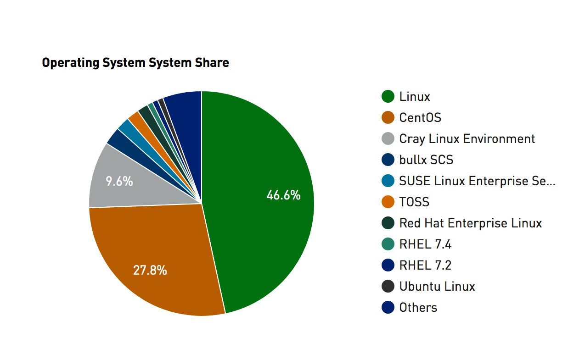
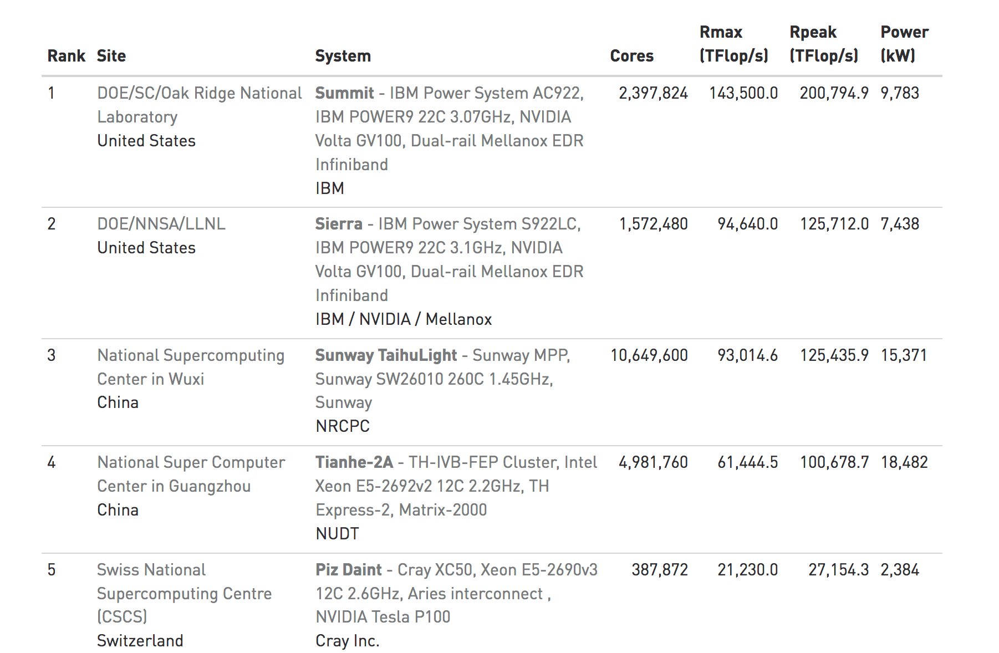
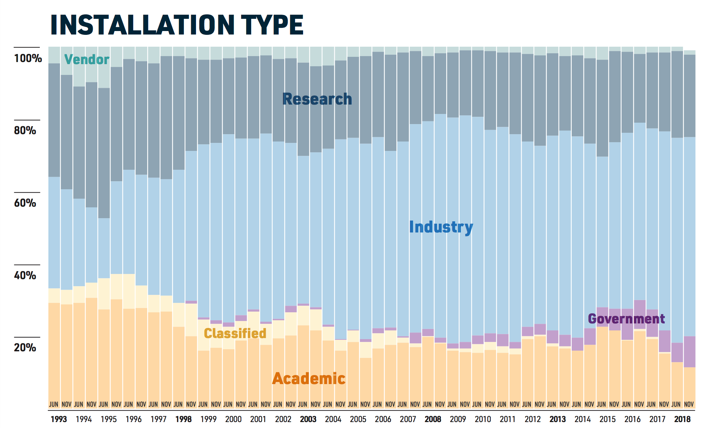
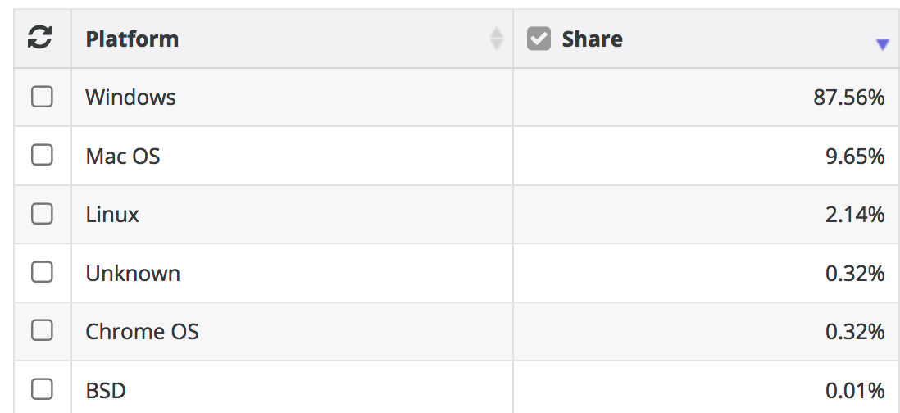
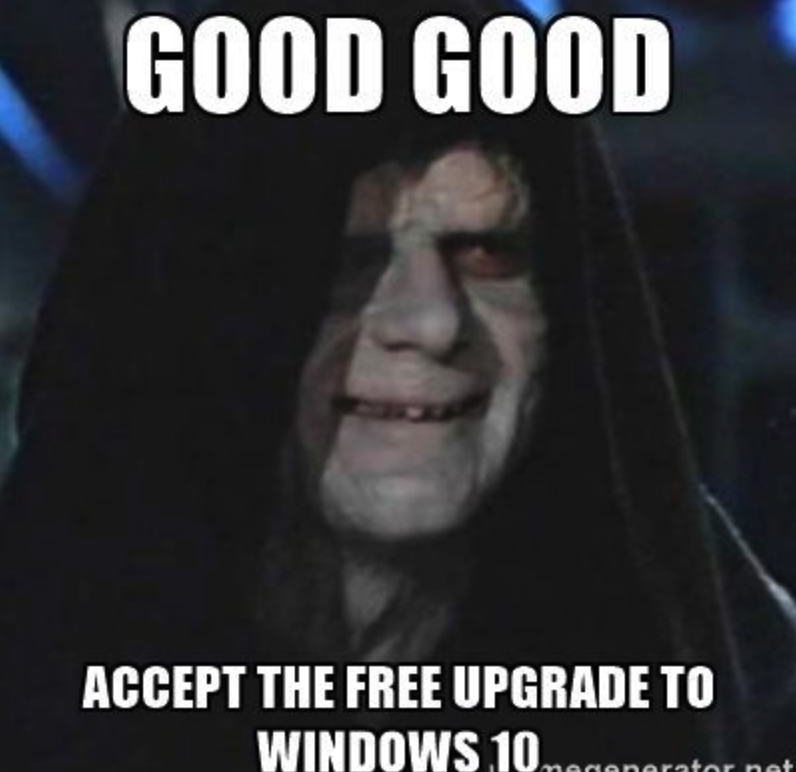
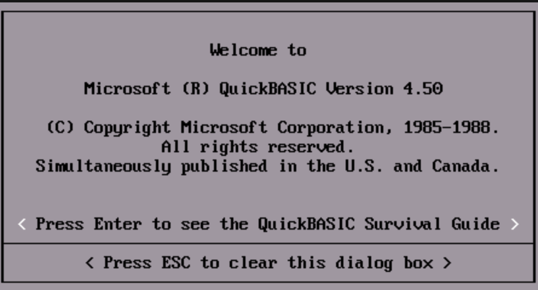
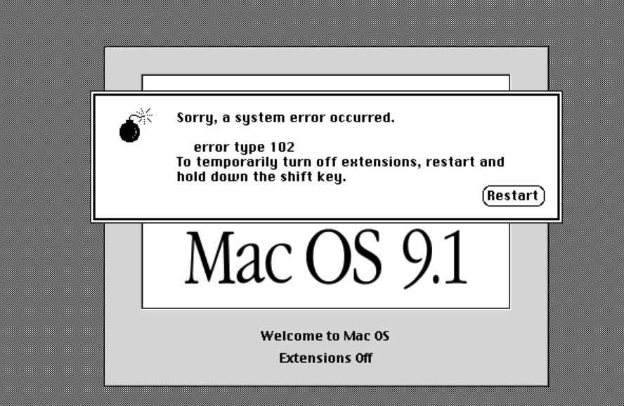
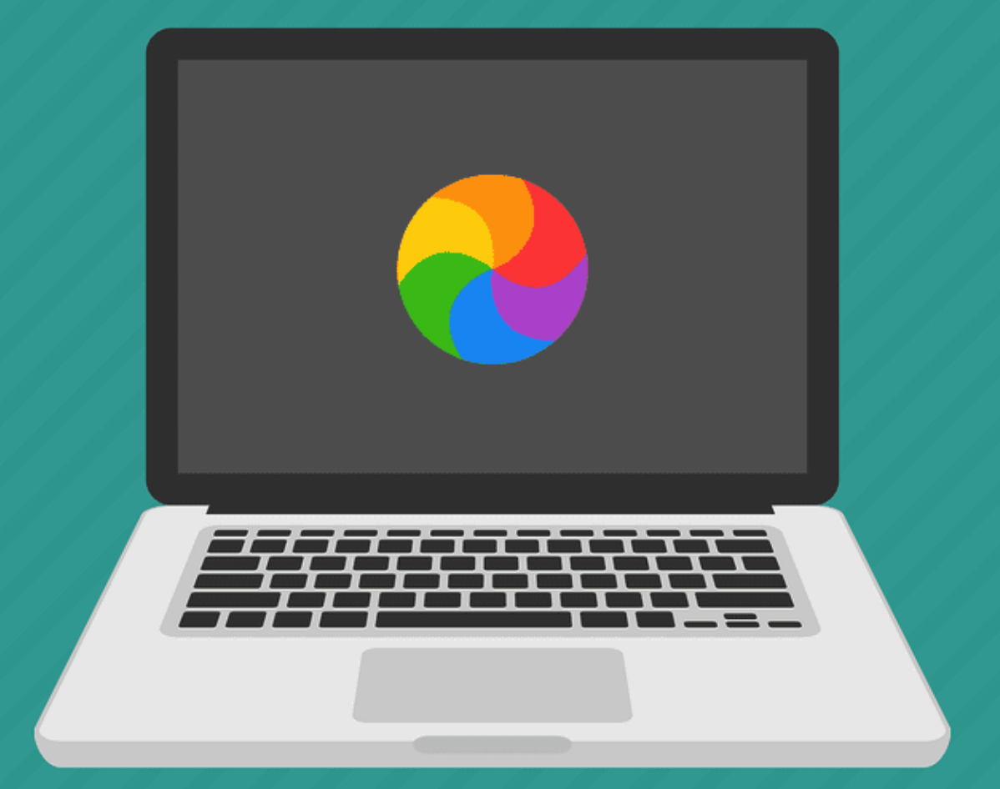
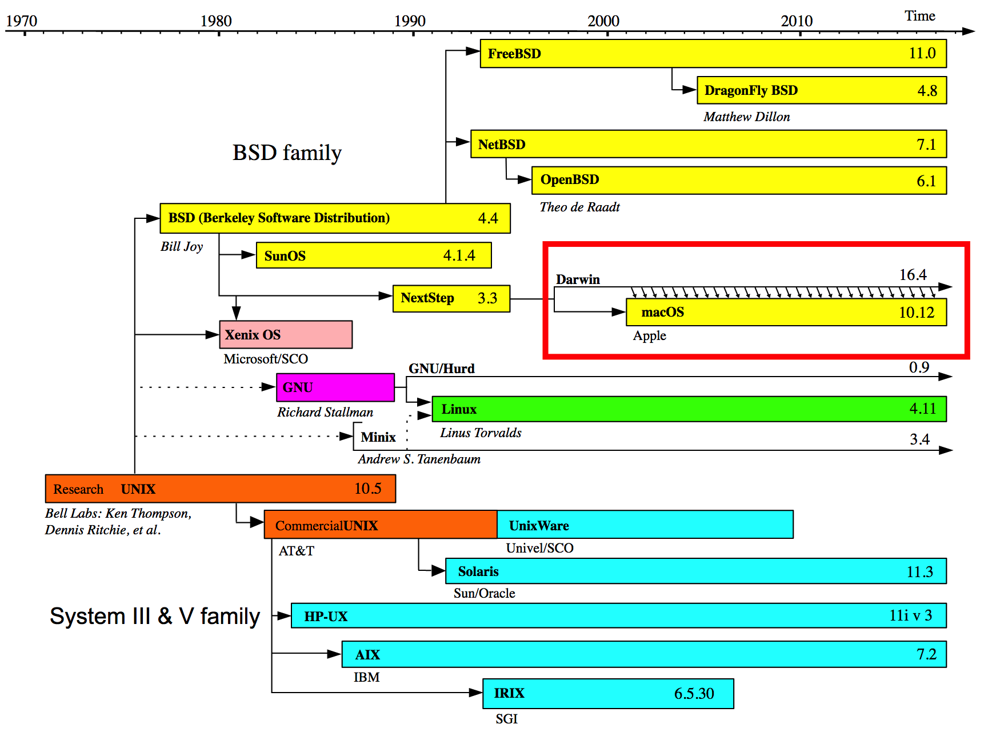
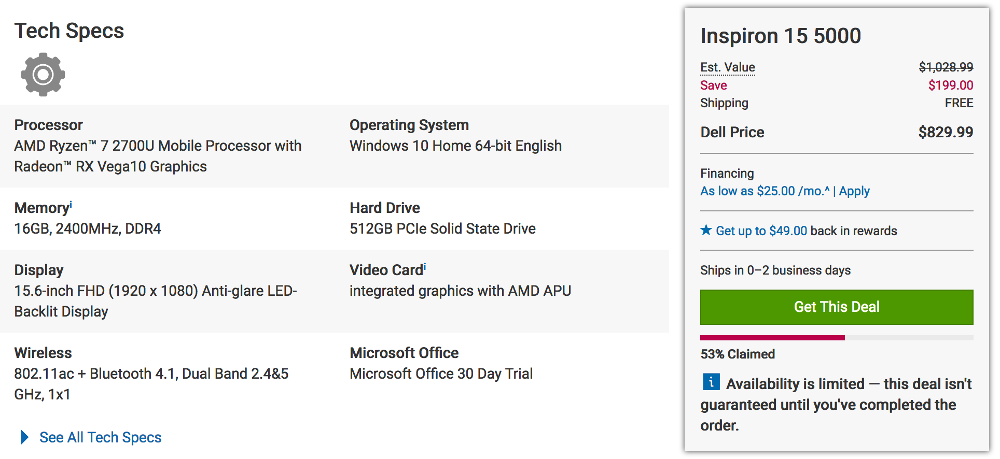

--- 
title: "Intro To Research Computing"
author: "Steve Pittard"
date: "`r Sys.Date()`"
bibliography:
- book.bib
- packages.bib
description: Cloud Computing
documentclass: book
link-citations: yes
site: bookdown::bookdown_site
biblio-style: apalike
---


# Computation In Research 

Biomedical and Public Health Research is increasingly reliant upon computation to achieve its aims. There are a number of considerations to make when thinking about how best to conduct computationally-assisted work. This also includes ideas on how to develop, maintain, and implement software pipelines. When doing literature reviews it is increasingly common to see references to programs written in R, Python, Java as associations with databases, REST APIs, and various cloud architectures. What this means is that it is incumbent upon researchers to learn something about analytics tools and supporting development languages to be competitive. Hopefully, this information can clear up some confusion and provide some basic ideas on how to be productive.

**Summary:** Linux and UNIX (considered here as one in the same although technically that's not true) has the largest market share by far when considering computational research. If you intend on pursing research and want to use computation at scale then Linux is the way to go. You can still use OSX or Windows as a way to access Linux servers or you could use a Linux desktop. We'll learn about accessing remote LINUX servers and cloud instances. 

It's always helpful to understand the trends to see where things are going. At one time most of the world's computing took place on privately owned resources. It turns out that that is still the case. Check out the following:


## What Do the Top Sites Use ? 

If you are fortunate then you have access to a professionally maintained computational cluster that has all the packages and languages you need along with a highly responsive staff who will answer questions for you and provide assistance in the design of large scale runs. Most people do not have access to such resources or if they do it is basic access to a cluster with little or no add on support. It depends on your department and institution. 

Consider the site [Top 500](https://www.top500.org/project/introduction/) website whose mission is to provide information on the Top 500 most significant computational installations in the world. This is important not just from an enthusiast or geek point of view but as an indicator of what it takes to support aggressive types of computational research. 


> Statistics on high-performance computers are of major interest to manufacturers, users, and potential users. These people wish to know not only the number of systems installed, but also the location of the various supercomputers within the high-performance computing community and the applications for which a computer system is being used. Such statistics can facilitate the establishment of collaborations, the exchange of data and software, and provide a better understanding of the high-performance computer market.








## Division of Labor

There is a natural tendency to use one's laptop or desktop computer to do some analysis which, in a general sense, is okay. This can be very useful for learning a particular approach or becoming familiar with a package you read about in a research paper. The laptop can also be a great place to work on creating prototypical applications that are modest in size with the idea of eventually moving them to larger infrastructure for scaling.

### Mixing Work and Pleasure

When getting a desktop or laptop everyone starts out with the best of intentions by wanting to devote the computer to a specific set of tasks. Although over time the laptop becomes a mixture of work and pleasure along with some activities that involve both. If you organize your hard drive well then you can easily make distinctions between personal and work data but eventually it becomes unclear as to what is what. Also keep in mind that most laptops and desktops are configured and optimized to support general office productivity such as accessing the Internet, reading E-Mail, and preparing documents. One can also install applications such as SAS, SPSS, or R-Studio to do some analysis and if the size of the input data is manageable then this is fine. 

### Mixing E-Mail and Research ?

The trouble starts when you have to install tools that require additional configuration or adjustments to system permissions which might then impact other programs on the system. Usually this isn't the case but I've filled up my hard drive with data files on a system that is ostensibly for personal productivity. So not only does the system become unwieldy for analysis but then I have no room for my office stuff. Let's put it another way, you do not want to be doing serious research and computation on the same computer you normally read e-mail on. I've seen people trying to open e-mail attachments that causes the system to reboot thus destroying a long running process. 

### You'll Do It Anyway

The lesson here is that once you hit a certain threshold of analytics activity or start managing large data sets that gobble up most of you hard drive then it's reasonable to consider using a **server** or external computer that is optimized for analysis and data storage. At a minimum, you should move your data files over to a shared drive (if one is available) and refer to that location when doing work. Obviously, when going home you will need to make local copies or use the VPN to attach to the shared drive from home. 


## Popular Data Science Languages

Let's take a look at one survey that rates the most popular languages and frameworks used in Data Science. This is from the [KDNuggets](https://www.kdnuggets.com/) website. These aren't the only languages and there are some languages like [Julia](https://www.kdnuggets.com/) that are gaining some market share. The way to think about lists like this is that if you need a lot of these then you are probably heading in a direction that would benefit from using a Linux based server or a virtual machine or Docker of some type. Especially if you have lots of data to clean and transform. But you could install most of these tools on a laptop running Windows or OSX. Also remember that you would also use things like SAS, SPSS, Systat, Minitab, etc. 

<center>

</center>


## Is Windows Good For Computation ?

The Windows Operating System has a rich history as a desktop operating system for consumer level activity but this does not then mean that it's the best platform for accomplishing research. Most of the personal computers and laptops sold today come with some version of Windows which then implies that most people have will have a degree of familiarity with it. You can also install things like SAS, SPSS, Systat but those are also available on Mac OS which we will get to soon enough. 

{width=500}

## What's Wrong with Windows ?

Nothing - as long as you like getting viruses and having to install a never ending series of software updates that seem to only compound the very problems that the updates alleged to address in the first place. For many people, it's a fine Operating System for general office productivity. Information Technology managers **LOVE** it because it's what "everyone else uses" even if that's not a particularly good reason to do something. 

### Windows Security, Virus, and Performance Issues

Do I **REALLY** need to convince you of this ? Windows has many security and virus problems to the extent that you MUST have Anti Virus tools installed that itself frequently prevents the installation of packages. Lots of IT managers will deprive the user of management permissions which requires the user to then go get help simply to install a package or tool. Default permissions are usually set to prevent most anything from being installed to make administration easier. 

There are some good IT people and I'm speaking in general here. It's just that the typical Windows support person does not have a research or computation background so their interest in helping is probably going to be restricted to the "bread and butter" activities such as keeping the system healthy for running other MS products, accessing the web, email and calendering. On the other hand that should tell you everything you need to know - that industry and academia tend to view MS Windows as an office productivity setup so they rarely devote research support resources (but they should offer reasonable alternatives).


### Windows Reboots and Updates

Have you ever encountered the Windows Update screen that holds your computer captive, sometimes for hours, to install updates that no one other than Microsoft knows what they are actually for ? Well, they do have a site you can go to that describes the "fixes". And then there are the times when the updates failed so you have to disable virus protection and repeat the process. And then you have to remember to re-enable virus protection. Windows Update is always there waiting for you to restart your system - and you will because inevitably your system will slow down for unknown reasons and of course the recourse is always to reboot. But Windows Update is ALWAYS watching:

<center>
{width=400}
</center>

### Is Linux Really Better ? 

Bioinformatics thrives on open source tools the vast majority of which are built on Linux/UNIX. However, frameworks like R and Python will run on Windows so you CAN in fact do some things on Windows assuming you have control of your computer to install things. Linux offers an excellent package management system to help install specific tools (compilers and databases) you might need to develop code. It all depends on what you want to do. Most people who use Linux do not also run general office productivity apps on the same system although you could certainly do this. 

The typical Linux user is a scientist or developer who uses open source tools as part of their daily work. Let's say that you read a research paper and see that there is a cool package or tool that was developed using open source so you want to run it. If you are lucky then it's in the form a package that can be run under, for example, R in which case you can implement it on your Windows or Apple system. 

**The problems come in when you want to "Scale Up" your activities and run tens, hundreds, or thousands of jobs at which point Linux is required**. If you think that your computational activities will remain at a modest level then maybe you don't need to learn or use Linux but in the era of "Big Data" that is something of a gamble. Amazon and Google both provide pre-made Linux images that come pre-installed with a number of tools likely to be of interest to a statistician or bioinformatics person. But you will still need to learn something about Linux administration be productive. However, a little knowledge will go a very long way 

### Cool Things About Linux

See https://www.gotothings.com/unix/unix-features-and-advantages.htm for a long list some of which are summarized here:

**Portability:**

The system is written in high-level language making it easier to read, understand, change and, therefore move to other machines. The code can be changed and complied on a new machine. Customers can then choose from a wide variety of hardware vendors without being locked in with a particular vendor. 

**Machine-independence:**

The System hides the machine architecture from the user, making it easier to write applications that can run on micros, mins and mainframes. 

**Multi-Tasking:**

Unix is a powerful multi-tasking operating system; it means when a active task in in process, there can be a simultaneous background process working too. Unix handles these active and background threads efficiently and manages the system resources in a fair-share manner.

**Multi-User Operations:**

UNIX is a multi-user system designed to support a group of users simultaneously. The system allows for the sharing of processing power and peripheral resources, white at the same time providing excellent security features. 

**Hierarchical File System:**

UNIX uses a hierarchical file structure to store information. This structure has the maximum flexibility in grouping information in a way that reflects its natural state. It allows for easy maintenance and efficient implementation. 

**UNIX shell:**

UNIX has a simple user interface called the shell that has the power to provide the services that the user wants. It protects the user from having to know the intricate hardware details. 


### Linux is The Native Environment for Development. 

Linux provides support for almost any programming language you can think of. This includes Python, C/C++, Java, Perl, Ruby, FORTRAN, R, and many, many more. There are compilers and toolkits for using these languages on Windows assuming you can get the permission to install them and you know how to work the "Command Shell" in Windows. There are also IDEs (such as R Studio) that will run on Windows to insulate you from the command line but if you want to work on the domain of "Big Data" you will inevitably need to use the command line. 

Ironically, Microsoft, as a company, got its start by providing compilers for developing software products. They strayed from that mission (much to their financial advantage) to become the premier consumer operating system. Clearly this move worked out quite well for Bill Gates but the company took a direction guided by the needs of the mass market. Can't say that I blame him for that. Anyway, bask in the glory of the splash screen for Microsoft Quick Basic which at one time was really cool if only for a short time. By then 1985 there were other compilers for "better" languages such as Pascal and C. 

<center>
{width=450}
</center>

### Command Line Knowledge is Next Level Stuff 

Linux offers the "Terminal Window" which is the primary interface to the operating system although Linux also provides a number of "nice" GUIs (Graphical User Interfaces) to interact with your files. Using the command line though becomes a very powerful way to create code and run it. Things like R Studio insulate you from having to do this but even that provides a way to interact with the "command line". 

Windows command line support is terrible. In fact, Windows was designed to keep the end user AWAY from the command line which is massively inconvenient for those with a programming background or a general need to be productive with code. They do have something called "Powershell" which is aimed at Windows administrators but the end user can access it also. Note that if anyone ever asks you to do something to "edit the Windows Registry" then watch out ! 

### Is There Hope For Windows Users ? 

You can in fact get work done using Windows especially if you are using apps like R Studio, SAS, etc though at some point you will probably hit a permissions error or need to install something (e.g. LaTex) that requires a lot of work and troubleshooting just to do something that would take like 5 seconds on Linux or Apple OSX. Also remember that being able to **scale up** your analysis is more easily accomplished on Linux than Windows. 

This doesn't mean that you should abandon your Windows laptop just that as you plan for a future career in research that might involve computation then you want to look at solutions that involve Linux. Both [Google](https://cloud.google.com/) and [Amazon](https://aws.amazon.com/) offer excellent support for Linux instances as part of their cloud offerings. Even the [Microsfot Azure cloud service](https://azure.microsoft.com/en-us/) offers Linux support as part of their service so they understand the importance of Linux in the scheme of things. 

## Is There a Middle Ground ?  

Yes there is. You can always use Windows to remotely access a Linux computer using tools such as Putty but this assumes that someone has setup that remote system for you. This is where Amazon and Google come in with their cloud services. In effect you are using your Windows laptop to access another computer so you don't have to install very much on your local system. But this also assumes that you know something about Linux.


### Virtualized Systems

You can also use Virtualization software such as Oracle's freely available [**Virtual Box**](https://www.virtualbox.org/) that allows you to install Linux within a "fully virtualized computer" that is hosted within an application running on your Windows box. 
Just installing Virtual Box isn't enough. You then have to pick the appropriate distribution of Linux you want to run and then install that. 

The advantage of this approach is that it provides access to a completely different operating system (in this case Linux) that appears to be an entire functioning machine that uses your system's CD/DV, mouse, track pad, etc just like a "real" machine. You need to use key combinations to switch between your virtualized and host systems but that's just part of the learning curve. VirtualBox runs on top of Apple, Windows, and Linux systems which means, for example, that you could run a copy of Windows on top of an Apple laptop. 

Using VirtualBox and fully exploring it's power requires you to know about administration and management of the operating system in question which is why some people shy away from it though it remains a powerful tool for running multiple operating systems on one host. From a practical point of view you need to make sure that you desktop or laptop has enough memory and disk space to practically use VirtualBox since any operating systems you virtualize will share resources with your hardware. If you have around 8GB or more of RAM and at least 100GB free then you should be fine. But you also need to take into account any data sets you plan to process. 


### Dockers

If using Virtualbox seems too much then consider using "[Docker](https://www.docker.com/)" technology which is a form of lightweight virtualization designed to give users easy access to specific services (e.g. other operating systems, analysis packages, databases,etc) without requiring a full on installation of something like VMWare or Virtualbox. Docker "images" are created by a community of interested users who then publish the images onto a repository or registry, usually [Dockerhub](https://hub.docker.com/), for use by others. Running them involves first installing the Docker software for your operating system and then issuing some commands that pulls down the image and executes it within a "container" that can interact with your local operating system. 

As an example, let's consider the following scenario:

* I have R installed on my laptop and it has all the packages I need to do my work.

* I read some research paper that points me to a new R package that requires the latest version of R

* I have no interest in updating my local version of R just to get this package which might not ever do what I want it to do. 

What are my choices here ? Well, I could loin to a system somewhere that does have the latest version of R. This is where services like Amazon and Google come in handy since I can spin up my own Linux servers and experiment on them but let's say I don't want to spend any money on that. I could install Virtualbox and Linux on top of that but that's too much work. I know, I'll install the Docker software appropriate to my system (Apple) and run the latest version of R in a container. This executes the latest version of R in a protected container that in no way interferes with my existing version of R. I could also do this with another operating system altogether such as running Ubuntu Linux in a container on my Apple. 


```{r eval=FALSE}
Steves-MacBook-Pro:~ esteban$ docker run -it rocker/r-base
Unable to find image 'rocker/r-base:latest' locally
latest: Pulling from rocker/r-base
71c170c5dae2: Pull complete 
1b76173b98c5: Pull complete 
1b00be862536: Pull complete 
c48ed365264c: Pull complete 
b2f3e26a95d6: Pull complete 
bdb9fc7fc7fb: Pull complete 
Digest: sha256:0589141389482d3211dbc9ccef20e1b426cc8ed7644c2ef0f60862becf3bea4e
Status: Downloaded newer image for rocker/r-base:latest

R version 3.5.3 (2019-03-11) -- "Great Truth"
Copyright (C) 2019 The R Foundation for Statistical Computing
Platform: x86_64-pc-linux-gnu (64-bit)

R is free software and comes with ABSOLUTELY NO WARRANTY.
You are welcome to redistribute it under certain conditions.
Type 'license()' or 'licence()' for distribution details.

  Natural language support but running in an English locale

R is a collaborative project with many contributors.
Type 'contributors()' for more information and
'citation()' on how to cite R or R packages in publications.

Type 'demo()' for some demos, 'help()' for on-line help, or
'help.start()' for an HTML browser interface to help.
Type 'q()' to quit R.

> 

```

### Anaconda

From the [Anaconda page](https://docs.conda.io/projects/conda/en/latest/):

> Conda is an open source package management system and environment management system that runs on Windows, macOS and Linux. Conda quickly installs, runs and updates packages and their dependencies. Conda easily creates, saves, loads and switches between environments on your local computer. It was created for Python programs, but it can package and distribute software for any language.

Conda is tool that allows you to manage Python and (to an extent) R installations. It insulates you from the details of installing Python versions and allows you to maintain multiple versions of Python on one system should you need that type of environment. An advantage of this is that you can then easily install something like [Jupyter](https://jupyter.org/) Notebooks that facilitate development of Python code. 


## Apple OSX / macOS ? 

Hmm. Isn't Apple a proprietary system ?  Why yes it is but Apple laptops, unbeknownst to most people, runs a form of UNIX natively ! It's been there for some time. Just find the "Terminal" application. Start it up and you will see something like the following. The interesting thing about this is that the GUI (The Graphical User Interface) that you interact with is itself a process that runs on top of UNIX ! 

> The reason I am advocating Apple is not because I'm fond of paying more for a computer (see comparison below) but because it's much close to Linux by far than MS Windows which is good news for anyone who does BioMedical or Bioinformatics work - more generally anything opensource. 

<center>
{width=500}
</center>

### The Dark Years of Apple

It's way outside of the scope of this discussion to explain the history of Apple products and it's various operating system but for a number of years (mostly up to an including 2001) it suffered from stability and performance issues due to its general inability to effectively manage multiple processes which would then lead to unexpected crashes and screens like the following. This was so common that people called it **The Bomb**. The Microsoft equivalent was called "The Blue Screen of Death" aka **BSOD**. And there was a time when both Apple and Microsoft battled it out for the crown of unexpected crashes. 

<center>
{width=500}
</center>

Modern Apple systems do not crash nearly as often as the systems of old but occasionally they can, (due usually to hardware issues), and when it happens, one usually observes what is known as **The Spinning Beach ball** or **The Beach ball of Death**. In reality this can be more easily addressed than **The Bomb** which was more strongly associated with Max OS 9 but it's still a pain. Take comfort in the knowledge that it happens far less frequently than a decade ago. This is due to the fact that the Apple Operating System is running **on top** of UNIX which handles processes very efficiently. 

<center>
{width=500}
</center>

### Apple OSX vs Previous Apple Operating Systems

Around 2001 Apple decided to base it's interface on a UNIX type of operating system. This is something of a simplification but this introduced enhanced stability for the platform which in turn made development for OSX more uniform than before. What this means for you is that you have access to UNIX. This does not mean that you will instantly know how to use it but it's there if you want it. Check out this graphic which presents the history of the UNIX operating system and Apple's relation to that development tree:




Don't get me wrong - simply running UNIX does not guarantee enhanced performance for applications that don't take advantage of it but the Apple OSX User interface is very well integrated with UNIX which provides, at least in my experience, a much smoother experience overall with fewer crashes. 

### Let's Go Shopping !

Of course I understand the appeal of Windows-based laptops and desktops - they are quite inexpensive when compared to Apple products. For example check out the price on this Dell Inspiron. It also includes a 15.6 inch screen, a camera, fingerprint reader, touch pad, DVD, a 512GB Solid State Drive, and a bunch of USB and HDMI ports.




When looking at the comparable Apple there is a drastic price difference though keep in mind that the CPU is very good as is the display. But still there is a financial consideration to be made. But consider that the hardware and software are designed and implemented by the same company whereas with Windows based laptops the hardware can be designed by any number of vendors. For me, the performance and the relatively headache-free experience of not having viruses is worth it. Especially since I can develop very easily. Where this all falls apart is that with Window-based hardware one can usually add storage much cheaper. 


There are a number of ways to manage the installation of UNIX tools on your Apple laptop (or desktop) but many of the tools you would want access to at the command line are already installed. Apple offers something called XCode which provides access to compilers for development. Obviously they would like for you to develop applications that run natively on OSX but this isn't at all a requirements. But since it's all UNIX under the hood you can have compilers like gcc and gfortan. 

### Managing Software Locally

Usually you want to install one or more programming environments to facilitate analysis and the possible development of packages for eventual sharing with others. So it's common to install things like RStudio and perhaps Python along with commercial tools like SAS and MATLAB. This is possible and if done with care you should be okay. Specifically make sure you have plenty of hard drive space and plenty of RAM (at least 8GB or more) to realistically do any work.


### RStudio

This is usually a very straightforward installation process with few surprises and for the most part [RStudio](https://www.rstudio.com/) works very well. Where it doesn't work well is when you need to install packages that in turn require some other version of R than the one you have installed. 

#### BioConductor

[BioConductor](https://www.bioconductor.org/) is an add on environment for R that is dedicated to managing and analyzing data types of interest to bio medical investigators. However, it brings its own set of problems in that you have to use a special installer that is independent of the typical R package installer. This is because BioConductor imposes a specific structure on top of the data to ensure that downstream BioConductor packages can easily "digest" the incoming data. BioConductor is also highly dynamic and packages are updated frequently which can lead to version collisions. In recognition of some of these problems the BioConductor team recently introduced a new tool to manage BioConductor installations that allows one to install multiple versions of BioConductor alongside each other with interference. 
This is a convenience worth having if you plan to do a lot of bioinformatics work. To install BioConductor do the following within an active R installation:

```{r eval=FALSE}
# Get the installer if you don't already have it
install.packages("BiocManager")

# This will install most of the basic packages
BiocManager::install()

# Find available Bioconductor packages
BiocManager::available()

```

#### Python 

Python comes by default on Apple systems. The newer systems come with Python version 3 as general support for Python 2 is going away. This has nothing to do with Apple. It's a Python community kind of thing. So the bottom line is that if you need to have Python access you have it by default BUT it's best not to mess with the default installation since Apple OSX relies on Python to do some things administratively. At least this is what I have found. What I generally do is use the [Conda](https://conda.io/en/latest/) installer to manage different versions of Python on my Apple. You can also do this on Linux or MS Windows ! 

There is a smaller version of Conda called [Miniconda](https://docs.conda.io/en/latest/miniconda.html) which has a smaller installation foot print so you could start with that. That's the only difference. Both of these allow you to install multiple versions of Python in a way that insulates those respective versions from each other. This is great for evaluating, testing, and running various Python modules that might require differing versions of Python. Conda provides access to a number of pre-built channels that contain pre-built modules (such as numpy, scipy, scikit, matplotlib) which means all you have to do is install them without concern for downloading and compiling them yourself. This is a true convenience in that you almost never have to deal with version conflicts or compile modules yourself.

```{r eval=FALSE}
Steves-MacBook-Pro $ conda env list
# conda environments:
#
base                  *  /Users/esteban/anaconda3

```


